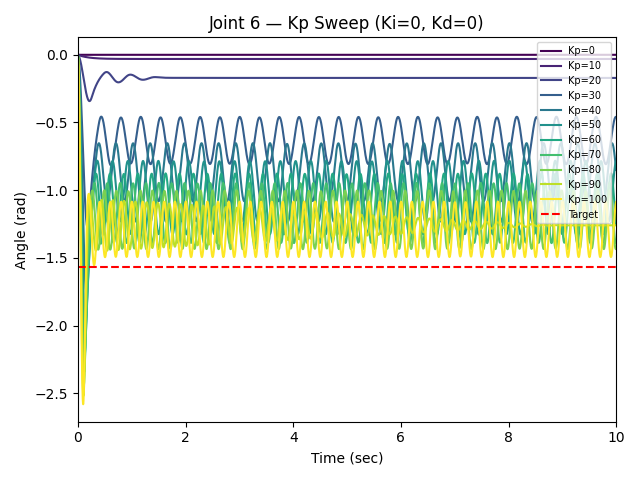

## Task 1 Objectives

- Install MuJoCo and load the UR5e model from MuJoCo Menagerie.
- Design one simple target object in Fusion360, then export it to MJCF or URDF using a tool such as fusion2urdf, and place it in the MuJoCo scene.
- Write your own PD/PID controller to move the robot arm to a target joint configuration. Do this by directly applying joint torques, rather than using MuJoCo's built-in position actuator. Tune the gains and plot the tracking error.

---

## Basic Setup

Test object, a bottle, was made in Fusion360 and exported to a MuJoCo scene through the fusion2urdf tool. The UR5e model from MuJoCo Menagerie was placed into the scene alongside the test object.


---

## What is a PID controller?

A PID, or Proportional-Integral-Derivative, controller is a feedback loop system used in automation to keep a system at a specific target.

A PID controller continuously calculates the error (target position - current position) and adjusts the output accordingly based on three terms: **P**, **I**, **D**

### Proportional (P)

This term observes the current error. If the error is large, the controller applies a large correction. If the error is small, it applies a small correction. Caveat to only using P: as you get closer to the goal, the error gets smaller, meaning the correction gets smaller, eventually balancing out just short of the goal. This is called **steady-state error**.

### Integral (I)

The Integral term looks at the accumulated history of the error. It measures how long the system has been away from the target and if this time continues to grow, the Integral term adds more power.

### Derivative (D)

The Derivative term is a predictive term. It looks at the rate of change. It determines how fast the error is shrinking or growing. A system that is growing too swiftly is slowed down by the Derivative term.

### Mathematical Equation

$$u(t) = K_p e(t) + K_i \int_{0}^{t} e(\tau) d\tau + K_d \frac{de(t)}{dt}$$

Where:
- $e(t)$ is the current error.
- $K_p$, $K_i$, and $K_d$ are the gains (tuning constants) that engineers adjust to make the controller responsive, stable, and accurate.

The error will be calculated by taking the difference of the target and current position. The gains of $K_p$, $K_i$, and $K_d$ are the parameters I will be adjusting to tune the UR5e robot.

---

## Testing Kp, Ki, Kd limits

I created a separate controllers class to initialize and better control each joint of the 6 DOF robot in an isolated manner. Setting my target to -90 degrees or -1.5708 rad allowed me to visualize relative accuracy of the joint. Joint 6 was my first joint I tested. Starting from a **Kp** value of 10, I progressively increased the gain.

At a certain point, the joint became unstable and started to oscillate. At this point I had 2 problems: using Kp alone either caused the arm to never reach its target position or it would oscillate, although in steady state. I also needed a quantitative method of observing the joint movement.

Using the matplotlib library, I collected position data of the joint for a given length of time and graphed the results.

```python
steps = 10/dt

if(count < (steps)):
    collect_rad.append(float(data.qpos[5]))
    count += 1

if(count == steps):
    plot_graph(dt, collect_rad, target, controllers[5].Kp, controllers[5].Ki, controllers[5].Kd)
    count += 1
```


I also did a sweep of Kp values 0–100 in increments of 10 and 0–300 in increments of 50 while keeping Ki and Kd constant at 0.




This confirmed my observations from earlier.

---

## Plan to track data and optimize gains

- PD is enough because gravity compensation is included in the UR5e XML.
- $\frac{d}{dt}(\text{error}) = \frac{d}{dt}(\text{target} - \text{current}) = -\frac{d}{dt}(\text{current}) = -\text{velocity}$


problem I had. Resetting the simulation gave different results

 def reset(self):
    self.integral = 0.0

  # Detect viewer reset (Backspace) — data.time jumps back to 0
  if data.time < prev_time:
      for c in controllers:
          c.reset()
      collect_rad.clear()
      count = 0
  prev_time = data.time


  Joint 2 (The Shoulder) is a fight against Gravity: Because Joint 2 moves up and down, it is constantly lifting the dead weight of the arm. When it is flat, gravity has maximum leverage against it.Tuning Impact: It requires a massive Proportional gain ($K_p$) and a strong Integral gain ($K_i$) just to counteract gravity and hold its position. Without a high $K_i$, it will stall out or sag before reaching the target.Joint 1 (The Base) is a fight against Inertia: Because Joint 1 rotates left and right parallel to the ground, gravity doesn't pull it down. It doesn't need to struggle to stay in place once it stops.Tuning Impact: It needs very little to no Integral gain ($K_i$). Instead, the main challenge is starting and stopping the swinging mass.
