## Task 1 (Joint Control) Objectives

- Install MuJoCo and load the UR5e model from MuJoCo Menagerie.
- Design one simple target object in Fusion360, then export it to MJCF or URDF using a tool such as fusion2urdf, and place it in the MuJoCo scene.
- Write your own PD/PID controller to move the robot arm to a target joint configuration. Do this by directly applying joint torques, rather than using MuJoCo's built-in position actuator. Tune the gains and plot the tracking error.

---

## Basic Setup

Test object, a bottle, was made in Fusion360 and exported to a MuJoCo scene through the fusion2urdf tool. The UR5e model from MuJoCo Menagerie was placed into the scene alongside the test object.

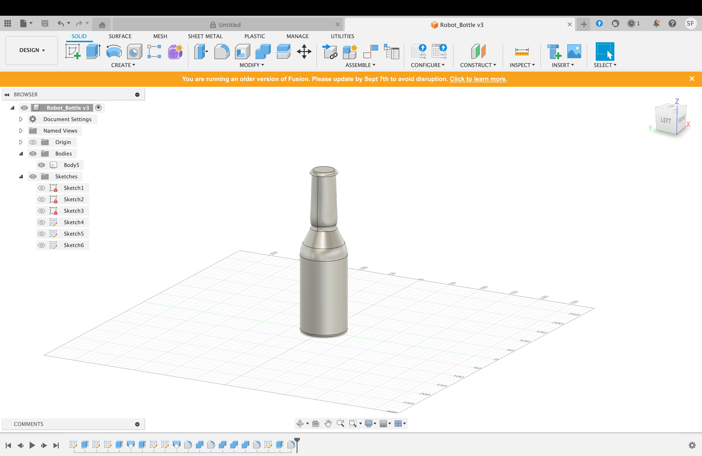
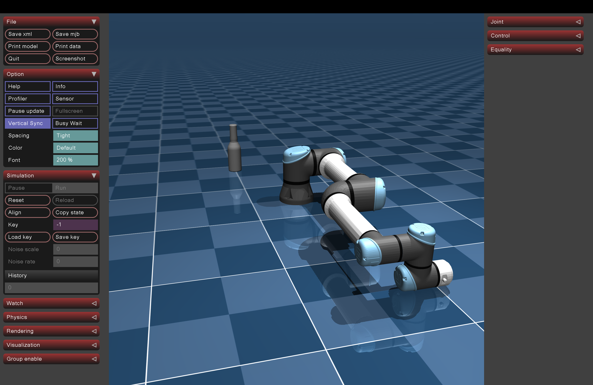

---

## What is a PID controller?

A PID, or Proportional-Integral-Derivative, controller is a feedback loop system used in automation to keep a system at a specific target.

A PID controller continuously calculates the error (target position - current position) and adjusts the output accordingly based on three terms: **P**, **I**, **D**

### Proportional (P)

This term observes the current error. If the error is large, the controller applies a large correction. If the error is small, it applies a small correction. Caveat to only using P: as you get closer to the goal, the error gets smaller, meaning the correction gets smaller, eventually balancing out just short of the goal. This is called **steady-state error**.

### Integral (I)

The Integral term looks at the accumulated history of the error. It measures how long the system has been away from the target and if this time continues to grow, the Integral term adds more power.

### Derivative (D)

The Derivative term is a predictive term. It looks at the rate of change. It determines how fast the error is shrinking or growing. A system that is growing too swiftly is slowed down by the Derivative term.

### Mathematical Equation

$$u(t) = K_p e(t) + K_i \int_{0}^{t} e(\tau) d\tau + K_d \frac{de(t)}{dt}$$

Where:
- $e(t)$ is the current error.
- $K_p$, $K_i$, and $K_d$ are the gains (tuning constants) that engineers adjust to make the controller responsive, stable, and accurate.
- $$u(t) is the output signal

The error will be calculated by taking the difference of the target and current position. The gains of $K_p$, $K_i$, and $K_d$ are the parameters I will be adjusting to tune the UR5e robot.

https://ctms.engin.umich.edu/CTMS/index.php?example=Introduction&section=ControlPID

---

## Tuning Gains Kp, Ki, Kd

I created a separate controllers class to initialize and better control each joint of the 6 DOF robot in an isolated manner. Setting my target to -90 degrees or -1.5708 rad allowed me to visualize/estimate relative accuracy of the joint. Joint 6 was my first joint I tested. Starting from a **Kp** value of 10, I progressively increased the gain.

At a certain point, the joint became unstable and started to oscillate. At this point I had 2 problems: using Kp alone either caused the arm to never reach its target position or it would oscillate, although in steady state. I also needed a quantitative method of observing the joint movement.

Using the matplotlib library, I collected position data of the joint for a given length of time and graphed the results.

```python
steps = 10/dt

if(count < (steps)):
    collect_rad.append(float(data.qpos[5]))
    count += 1

if(count == steps):
    plot_graph(dt, collect_rad, target, controllers[5].Kp, controllers[5].Ki, controllers[5].Kd)
    count += 1
```

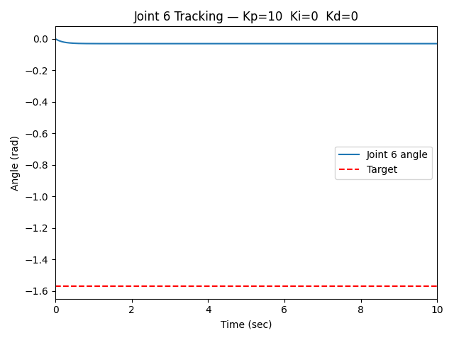

I also did a sweep of Kp values 0–100 in increments of 10 and 0–300 in increments of 50 while keeping Ki and Kd constant at 0.


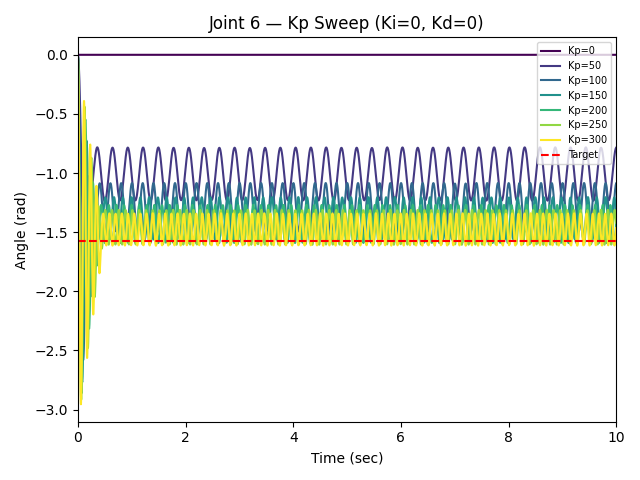

This confirmed my oscillation observations from earlier.

### GUI

Up to this point, I had been hardcoding the values of the gains of each joint one at a time. This was not going to be a viable solution if I was going to keep track of all gains of each joint. A quick search for a third party software that graphs and organizes my data did not yield a result that met my needs. Therefore, with the help of AI, I created a simple GUI around my graphing functions.

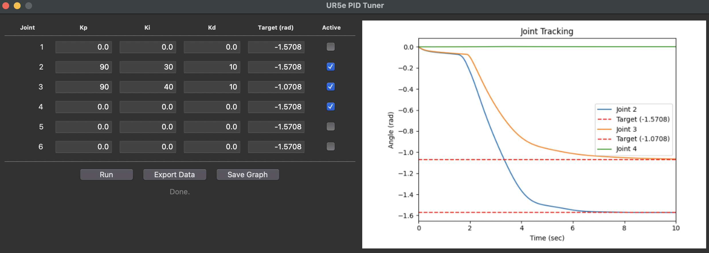

The new GUI allows each joint of the 6 dof robot to have adjustable PID gains, an adjustable target position, and a activation state (allows me to activate any combination of joints). The graph also now plots all activated joints.

### Tuning

For consistency, I chose all joints to have a target positon of -1.5708 rad. This position allows me to easily observe any oscillations that may occur while lessening the risk of the arm hitting the ground. Also, for this first stage, only 1 joint will be activated at a time while all other joints set to the default 0 rad position.

I seperated the 6 joints into 2 categories: joints that would be fighting gravity (categority 1) and joints that would not (category 2). I chose to tune the joints that would be fighting gravity on activation first (joints 2, 3, 4, and 6).

Of the category 1 joints, I chose to tune joint 2 first because it has the greateset moment of inertia (I = mr^2).

## Category 1 Tuning (Joint 2, 3, 4, 6)

The first method I tried was the Ziegler–Nichols tuning method. This method first sets the I and D gains to zero. The P gain is then slowly increased from zero until it reaches a state where the output has stable steady state oscillations. The P gain associated with this state is called the ultimate gain, $K_u$. Next the oscillation period $T_u$ is found. Using $K_u$ and $T_u$, Kp, Ki, and Kd are set.

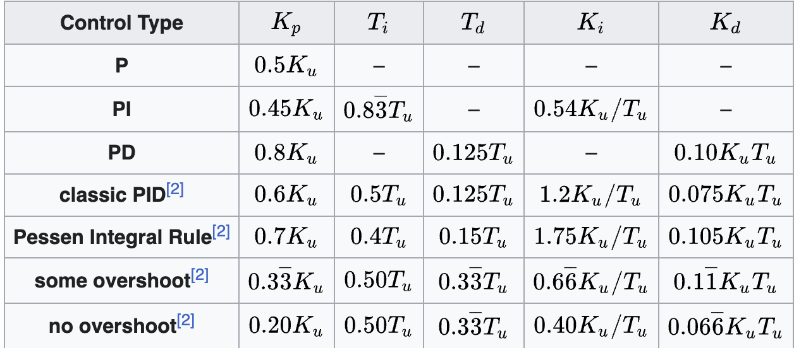

https://en.wikipedia.org/wiki/Ziegler%E2%80%93Nichols_method

The steady state oscillations started at 140. I first tried using the PD equations; however, no matter how high the D term was, the arm never reached it's target postion. I believe this was due to the heavy mass of the arm and the fact that this heavy arm is fighting gravity on its way up.

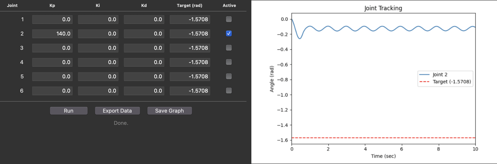

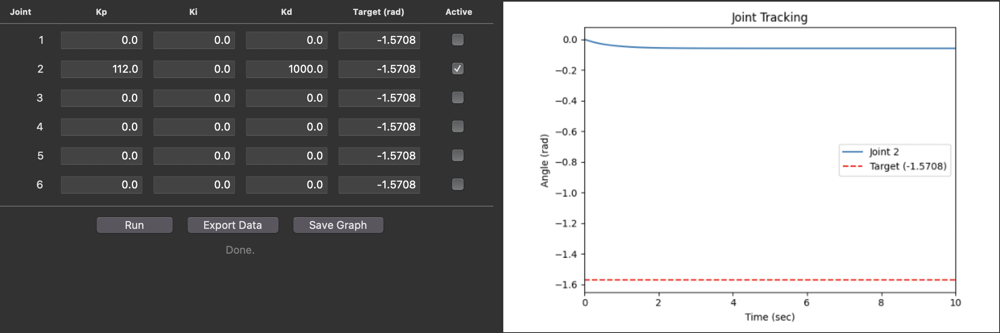

The arm was not reaching its target postion, so I tried adjusting the Integral term by calculating its classic PID values from the table above.

Using collected data, I found the period of oscillation, Tu, to be 0.984 sec.

Ku = 140
Tu ~ 1
Kp = 0.6Ku = 84
Ki = (1.2Ku) / Tu = 168
Kd = 0.075KuTu = 10.5

I noticed two problems about the movement of the arm with these settings. It had a sluggish start at the beginning and the underdamped oscillations.

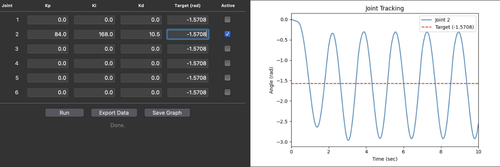

I was able turn the undamped oscillation into a underdamped oscillation by increasing the derivative term to 50.

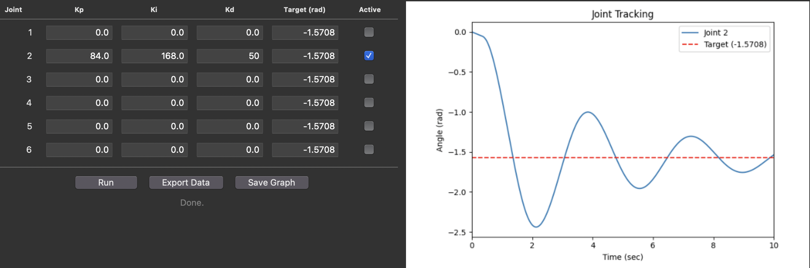

The next problem I solved was the sluggish start. Ziegler-Nicholas method did not account for the large mass the joint would be moving. Therefore I increased the Proportional gain. Kp = 250. This made a dramatic improvement. This removed the sluggish start and removed any oscillations and overshooting.

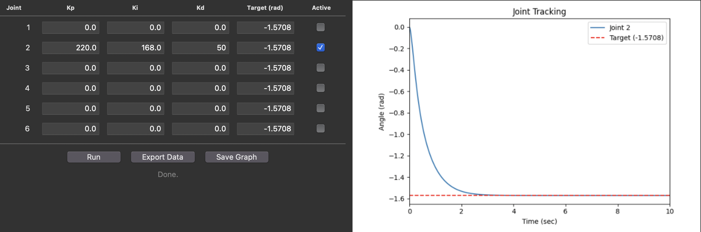

The next step was just seeing how far I could increase the Integral term without the output overshooting the target. The experimental value was Ki = 190.


The final gains for joint 2 were the following: Kp = 220, Ki = 190, Kd = 50.

Applying the same gains to joint 3 gave similar results to joint 2, although reaching its target position in a slightly greater amount of time. I increased the Integral gain of joint 3 until a overshoot of the target position was seen, from which the gain was dialed back. Applying the same gains as joint 2 for joint 4 led to an overshoot of the target. An overshoot signaled an Integral gain that is too large. Reducing the Integral gain to Ki = 70 removed this overshoot of the target position. As you move up each joint of this 6 DOF robot, each joint progressivly holds less mass. This explains the need to reduce the Integral gain as you tune joints closer to the end effector. Applying this logic, joint 6 was given the same gains as the tuned joint 4. No overshoot was observed.
<table>
  <tr>
    <td>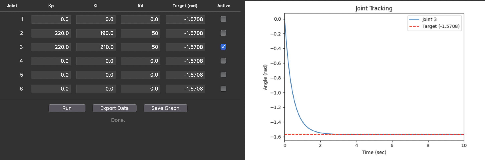</td>
    <td>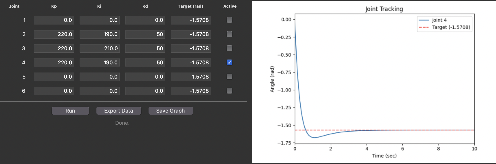</td>
  </tr>
  <tr>
    <td>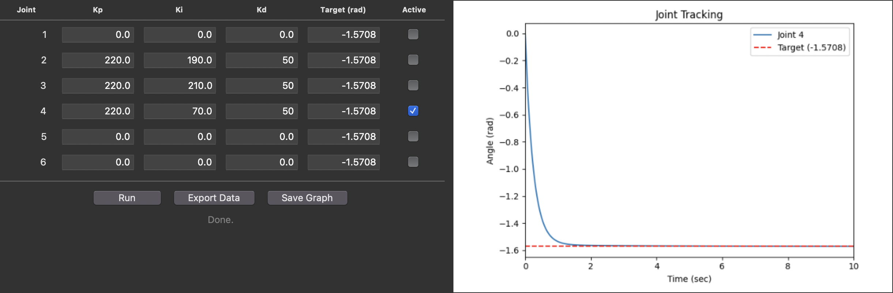</td>
    <td>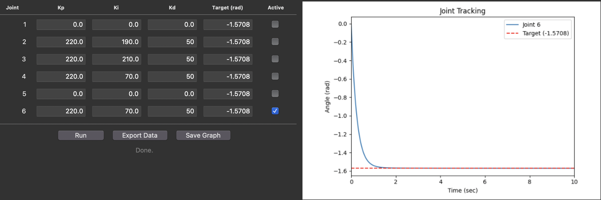</td>
  </tr>
</table>

By tuning each category 1 joint individually, each joint was tuned during a state of max load from gravity. Assuming static PID gains, this would prevent any overshooting in other arbitrary positions. However, this would also mean each joint would be overdampened in any other position to some extent. A simple test of moving all category 1 joints to -1.5708 rad at once showed no overshoot.

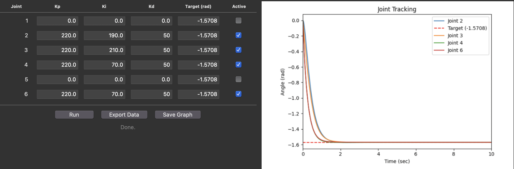

## Category 2 Tuning (Joints 1 and 5)

Applying my baseline gains of Kp = 220, Ki = 190, Kd = 50 to joint 1 predictively resulted in a graph that showed the joint reaching the target position at a slower rate (>4 sec). This makes sense because of the greater mass joint 1 is moving.

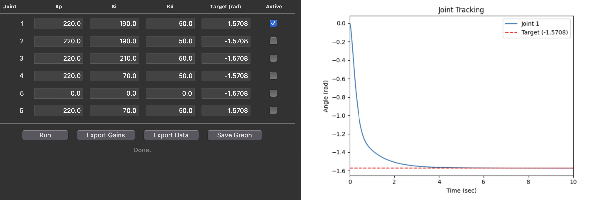

Increasing the Ki to 300 improved the result by decreasing the amount of time it takes for joint 1 to reach the target position.

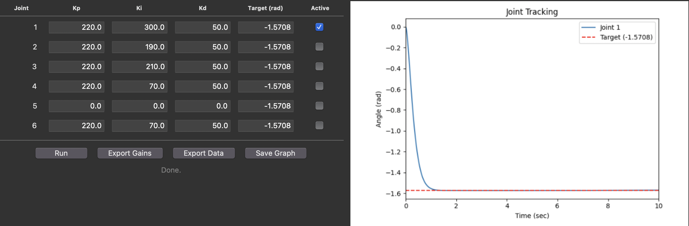

Applying gains from joint 4 that took into account the decreased mass to joint 5 gave good results.

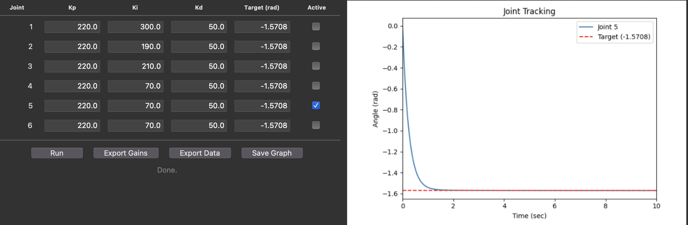

Testing both tuned category 2 joints at the same time (both target positions being -1.5708 rad) gave good, consistent results.

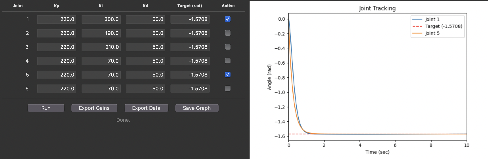

Testing all 6 joints (target position = -1.5708 rad) gave unexpected results. There was overshoot in joints 1 and 2

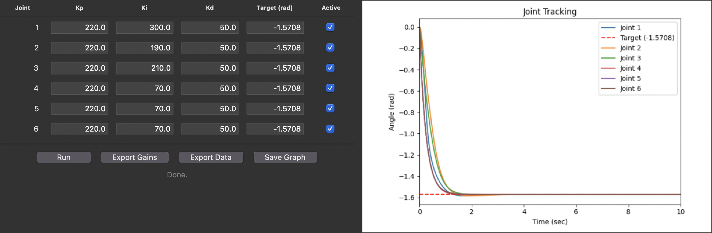

In my earlier analysis, I wrongly predicted any arbitrary position outside of max load would not result in overshoot. I hypothesised any arbitrary position would be in a state of being overdamped relative to the max load position.

What I failed to understand was coupled dynamics, only considering gravity load variation. The full equation of motion describing this robot arm is the following:

M(q) q̈  +  C(q, q̇) q̇  +  g(q)  =  τ

https://publish.illinois.edu/ece470-intro-robotics/files/2021/10/ECE470FA21Lec16.pdf
https://www.youtube.com/watch?v=wyALKpgSyls&t=54s

M(q) describing the inertia matrix. C(q, q̇) describing the Coriolis/centripetal terms which only show up when the joints are moving at the same time. g(q) describes the gravity term. When tuning the joints individually C was equal to 0. When all 6 joints moved simultaneously, 2 things changed: the Coriolis/centripital term appears due to simultaneous movement and the moment of inertia changes. Compared to individual tuning conditions, the moment of inertia decreased (classic ice skater bringing in thier arms problem). Therefore, my Ki is too "aggressive" which led to the overshoot. Reducing the Ki values of joints 1 and 2 resulted in no overshoot

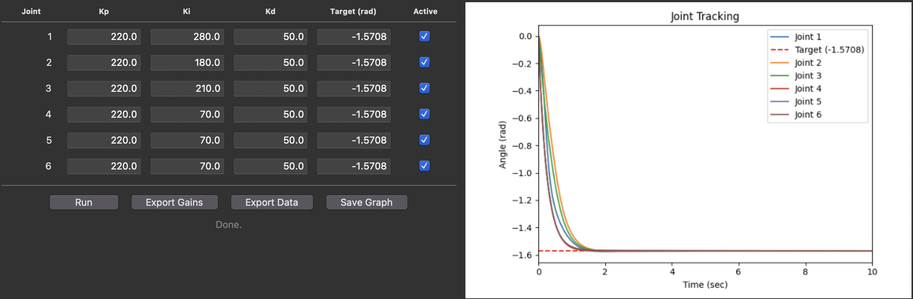
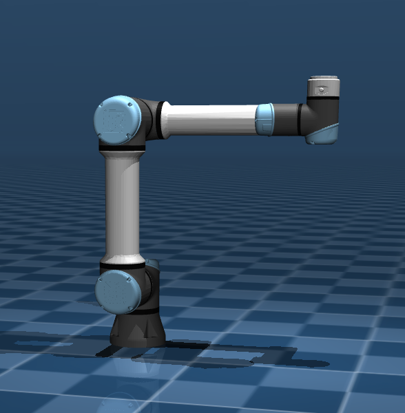

I tested a new configuration to test these new gains. The results show no overshoot.

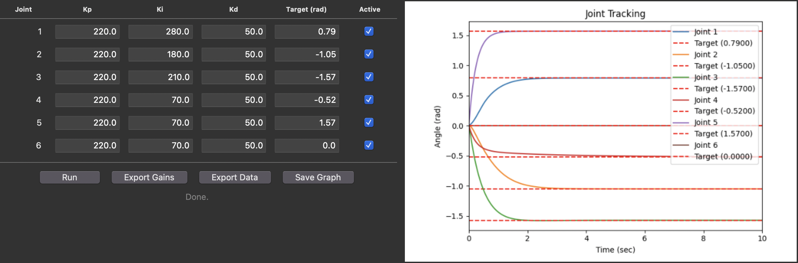
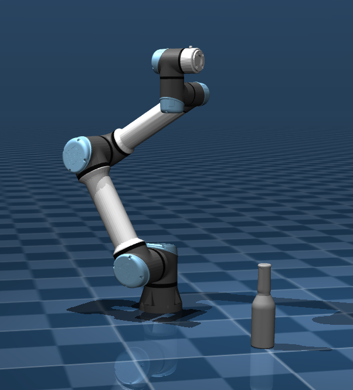

### Conclusion

A PID controller was successfully implemented and tuned for each joint of the UR5e robot by directly applying joint torques in MuJoCo. Joints were categorized by gravity load and tuned individually using a modified Ziegler–Nichols approach, with gains adjusted experimentally to eliminate steady-state error and overshoot. When all 6 joints were driven simultaneously, unexpected overshoot appeared in joints 1 and 2. This was caused by coupled dynamics: the Coriolis terms introduced by simultaneous joint motion and a reduction in effective moment of inertia made the tuned gains too aggressive. Reducing the integral gains of joints 1 and 2 fixed the overshoot. The results highlight the limitation that gains tuned in isolation cannot fully account for the configuration-dependent, coupled dynamics of the arm under simultaneous joint motion.

---


## Links

https://www.youtube.com/watch?v=HYVPysAGp6g&t=325s  
https://www.youtube.com/watch?v=P83tKA1iz2Y&t=4s
https://www.youtube.com/watch?v=qj8vTO1eIHo&list=WL&index=2
https://www.youtube.com/watch?v=uXnDwojRb1g&list=WL&index=3
https://youtu.be/gpQDZ5CNY5w?si=Aa5Wt4vvjfdDK_0r
https://youtu.be/6Ji4vuJg2dw?si=dgxjJufpGfe7cc4X
https://youtu.be/YYxkS1iFdVk?si=a6eL5xT4WUgtfsc_
https://youtu.be/PRFCBVTFy90?si=L7evkppVRTE_NFfT
https://youtu.be/yRDAThIxoOg?si=5HWkS9ue_LV8GKEL
https://youtu.be/qC7hrYJVvD8?si=Nffi90eSMxpAK3Yj
https://youtu.be/6EcxGh1fyMw?si=tMLRfKGMMI3snw3v