## Task 1 (Joint Control) Objectives

- Install MuJoCo and load the UR5e model from MuJoCo Menagerie.
- Design one simple target object in Fusion360, then export it to MJCF or URDF using a tool such as fusion2urdf, and place it in the MuJoCo scene.
- Write your own PD/PID controller to move the robot arm to a target joint configuration. Do this by directly applying joint torques, rather than using MuJoCo's built-in position actuator. Tune the gains and plot the tracking error.

---

## Model Setup

### Placing models
Test object, a bottle, was made in Fusion360 and exported to a MuJoCo scene through the fusion2urdf tool. The UR5e model from MuJoCo Menagerie was placed into the scene alongside the test object.

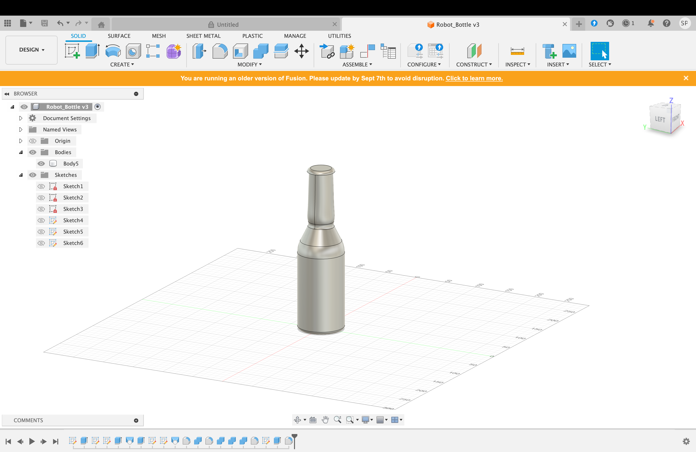

*Figure 1: Bottle model designed in Fusion360*

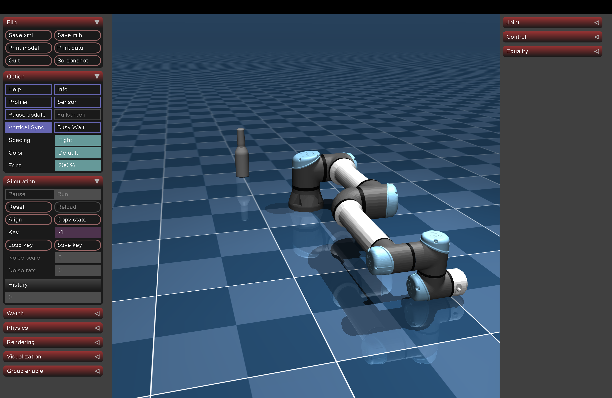

*Figure 2: UR5e and bottle placed in MuJoCo scene*

## Motor Modeling
The ur5e.xml configurations of the robot were changed from actuator <general> to <motor> to disable any preset damping or applied torque that would offset results from PID tuning.

  <actuator>
    <motor name="shoulder_pan" joint="shoulder_pan_joint" gear="1" ctrlrange="-150 150"/>
    <motor name="shoulder_lift" joint="shoulder_lift_joint" gear="1" ctrlrange="-150 150"/>
    <motor name="elbow" joint="elbow_joint" gear="1" ctrlrange="-150 150"/>
    <motor name="wrist_1" joint="wrist_1_joint" gear="1" ctrlrange="-28 28"/>
    <motor name="wrist_2" joint="wrist_2_joint" gear="1" ctrlrange="-28 28"/>
    <motor name="wrist_3" joint="wrist_3_joint" gear="1" ctrlrange="-28 28"/>
  </actuator>

The torque limits (ctrlrange) in Nm were gathered from the <default> ur5e configurations.

### Mechanical Joint Locking

In order to be able test joints individually without interference from non tested joints, all non tested joints were "mechanically locked" in simulation by locking the position to 0 rad.

  <equality>
    <joint name="lock_shoulder_pan_joint"  joint1="shoulder_pan_joint"  polycoef="0 1 0 0 0" active="false"/>
    <joint name="lock_shoulder_lift_joint" joint1="shoulder_lift_joint" polycoef="0 1 0 0 0" active="false"/>
    <joint name="lock_elbow_joint"         joint1="elbow_joint"         polycoef="0 1 0 0 0" active="false"/>
    <joint name="lock_wrist_1_joint"       joint1="wrist_1_joint"       polycoef="0 1 0 0 0" active="false"/>
    <joint name="lock_wrist_2_joint"       joint1="wrist_2_joint"       polycoef="0 1 0 0 0" active="false"/>
    <joint name="lock_wrist_3_joint"       joint1="wrist_3_joint"       polycoef="0 1 0 0 0" active="false"/>
  </equality>

### Friction Modeling

To determine the joint damping coefficients for the UR5e simulation, the viscous friction parameters ($k_{v,j}$) shown in the electro-mechanical model by Clochiatti et al. (2024) was used. Because the paper shows these viscous coefficients from the motor side of the actuators, they cannot be directly applied to MuJoCo’s joint space configuration. Instead, to account for the robot's harmonic drive gearboxes, each motor-side coefficient must be scaled to the output joint space. In Modern Robotics (Lynch & Park), it is explained that a gearhead scales speed down by the gear ratio $G$ while magnifying output torque by the same factor. The joint viscous damping scales by the square of its gear reduction ratio ($N_j = 100$ for all six joints) using the relation $B_j = k_{v,j} \cdot N_j^2$. This transformation accounts for the fact that the motor spins $N$ times faster than the joint—generating $N$ times more friction.

$$\tau_{\text{fric, motor}} = k_{v,j} \cdot \omega_{\text{motor}} = k_{v,j} \cdot (N \cdot \omega_{\text{joint}})$$

$$\tau_{\text{fric, joint}} = N \cdot \tau_{\text{fric, motor}}$$

$$\tau_{\text{fric, joint}} = N \cdot \left[ k_{v,j} \cdot (N \cdot \omega_{\text{joint}}) \right] = (k_{v,j} \cdot N^2) \cdot \omega_{\text{joint}}$$

These are the final physical damping attributes (damping="4.750", 10.730, 3.820, 2.950, 1.140, and 1.880 for joints 1 through 6, respectively) put directly into the MuJoCo XML joint definitions.

https://www.cambridge.org/core/journals/robotica/article/electromechanical-modeling-and-identification-of-the-ur5-eseries-robot/1AE5BAE866D9046F79C4B159BEA2B45F

https://modernrobotics.northwestern.edu/nu-gm-book-resource/8-9-actuation-gearing-and-friction/

---

## What is a PID controller?

A PID, or Proportional-Integral-Derivative, controller is a feedback loop system used in automation to keep a system at a specific target.

A PID controller continuously calculates the error (target position - current position) and adjusts the output accordingly based on three terms: **P**, **I**, **D**

### Proportional (P)

This term observes the current error. If the error is large, the controller applies a large correction. If the error is small, it applies a small correction. Caveat to only using P: as you get closer to the goal, the error gets smaller, meaning the correction gets smaller, eventually balancing out just short of the goal. This is called **steady-state error**.

### Integral (I)

The Integral term looks at the accumulated history of the error. It measures how long the system has been away from the target and if this time continues to grow, the Integral term adds more power.

### Derivative (D)

The Derivative term is a predictive term. It looks at the rate of change. It determines how fast the error is shrinking or growing. A system that is growing too swiftly is slowed down by the Derivative term.

### Mathematical Equation

$$u(t) = K_p e(t) + K_i \int_{0}^{t} e(\tau) d\tau + K_d \frac{de(t)}{dt}$$

Where:
- $e(t)$ is the current error.
- $K_p$, $K_i$, and $K_d$ are the gains (tuning constants) that engineers adjust to make the controller responsive, stable, and accurate.
- $$u(t) is the output signal

The error will be calculated by taking the difference of the target and current position. The gains of $K_p$, $K_i$, and $K_d$ are the parameters I will be adjusting to tune the UR5e robot.

https://ctms.engin.umich.edu/CTMS/index.php?example=Introduction&section=ControlPID

---

## Tuning Gains Kp, Ki, Kd

Testing out the Ziegler-Nichols method and tuning the PID values empirically led to the same problems: not using the Ki term seemed to result in a steady state error and trying to add Ki into the tuning seemed to lead to heavy overshoot. The second problem is known as integral windup where the integral term of the PID controller continues to accumulate causing the system to heavily overshoot and possibly oscillate. The solution to this problem was implementing a anti integral windup system where you put a integral term cap during torque computation.

Now I had to deal with 4 variables: Kp, Ki, Kd, and now the integral limit. With so many combinations of values, I felt the Ziegler-Nichols method and empirical tuning was not a valid option. This led me to use the ITAE technique.

When a controller tries to guide a system to a target value, it rarely hits it instantly. The difference between where the system currently is and where it wants to be is called the error, shown as $e(t)$. An ideal controller minimizes this error as fast as possible without causing the system to overshoot or oscillate. The ITAE method is a a mathematical formula that scores how well a controller is doing.

$$\text{ITAE} = \int_{0}^{\infty} t \cdot |e(t)| \, dt$$

$t$: Time$|e(t)|$: The absolute value of the error at that specific moment.

The t variable in the equation is a key factor when analyzing the effectiveness of chosen gains. When t is close to 0, the position of a joint is expectedly far from the target position. The t term therefore gives less of a penalty. The opposite is true once more time has passed: the longer the system stays away from the target postion, the more it will be penalized. 

This method allows me to test a wide range of PID gains by sweeping through ranges of all variables and scoring each combination; however, sweeping through every value of all 4 variables and going through each combination would not have been a efficient use of time. Therefore, I split the variables in to two groups: Kp/Kd and Ki/integral_limit. Even within these two groups I start the sweep in "big steps" of 20 for Ki and Kd. This allows me to find a smaller range of values to test using a step size of 1. The output of this process is a ITAE heat map with Kp and Kd values on each axis. The same process is done with Ki and integral limit (big step size is 5 for integral limit however) using the results of the previous sweep of Kp and Kd and keeping Kp and Kd as constants.

The first run through was unsuccessful. Because the ITAE method give favorable scores to combinations that get to the target position the fastest without regard for torque limits, it gives values far beyond what is reasonable physically for the robot when considering torque limits. Although a torque limit of 150Nm and 28Nm was applied to size 1 and size 3 joints respectively, these gains were resulting in long saturation times. 

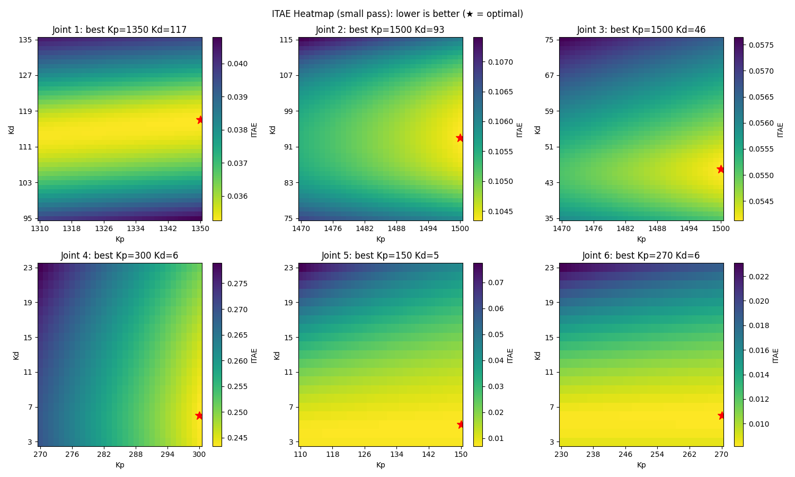

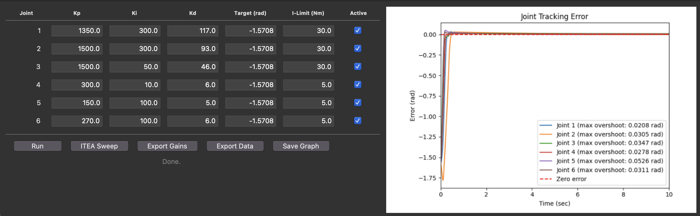

Therefore, I added my own term to the ITAE equation: a penalty proporitonal to the amount of time the robots stays outside of the torque limits.

    overage = np.maximum(0.0, np.abs(torques) - tau_max)
    penalty = float(np.sum(overage**2))

    return itae + 1.0 * penalty

The square on each overage term penalizes larger values outside of the torque limits. The constant multiplied with penalty was set as an arbitrary value.

The next result was much better at staying within torque limits; however the system felt very sluggish. This meant that the penalty coefficient was far too large. This is also seen by the program highly favoring lower Kp values, leading to flooring the lower end of the Kp range given.

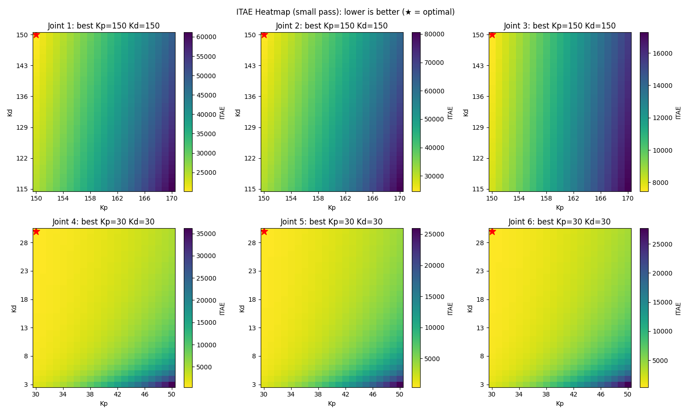
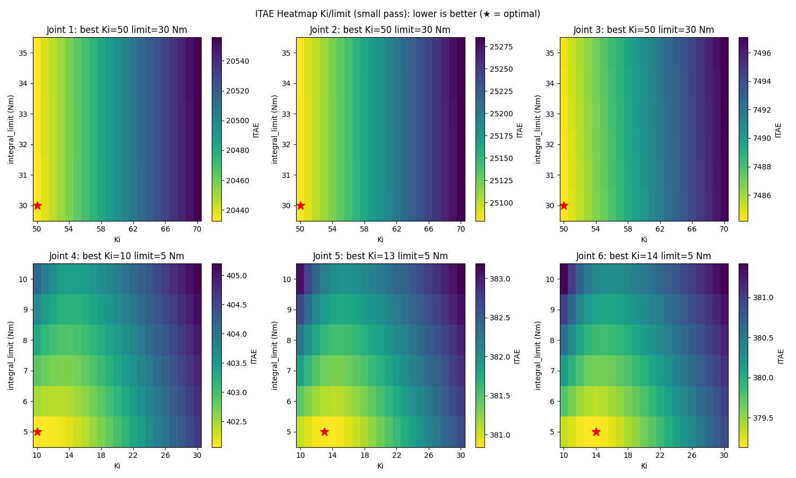
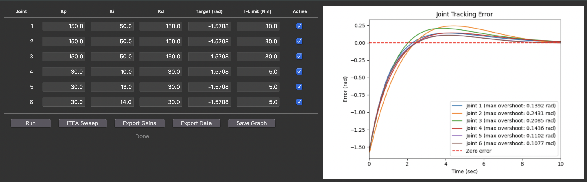

After testing values between 0.0 and 1.0, a coefficient of 1e-8 was determined to output gains with a good balance of staying within torque limits and velocity.

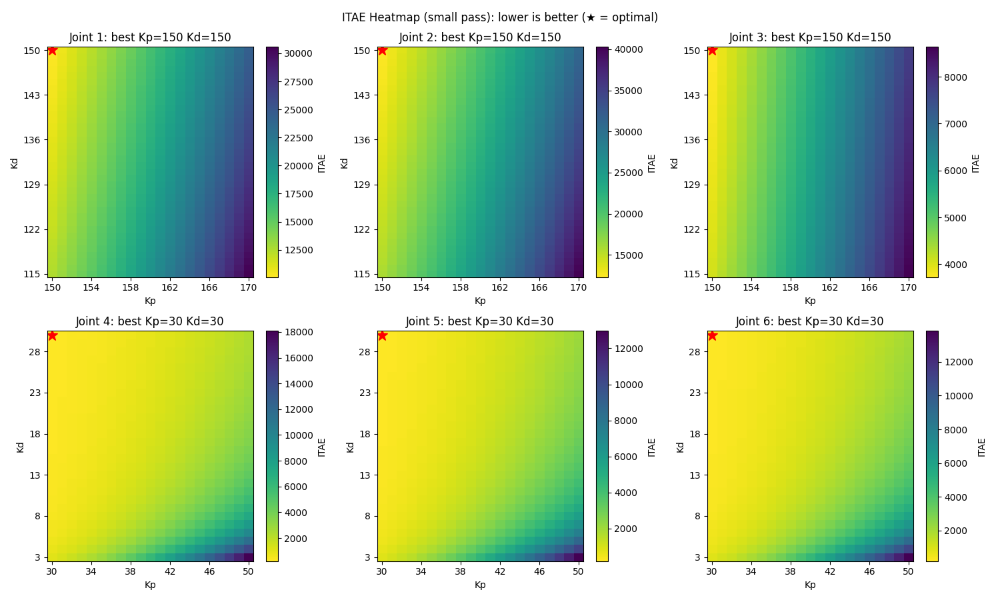
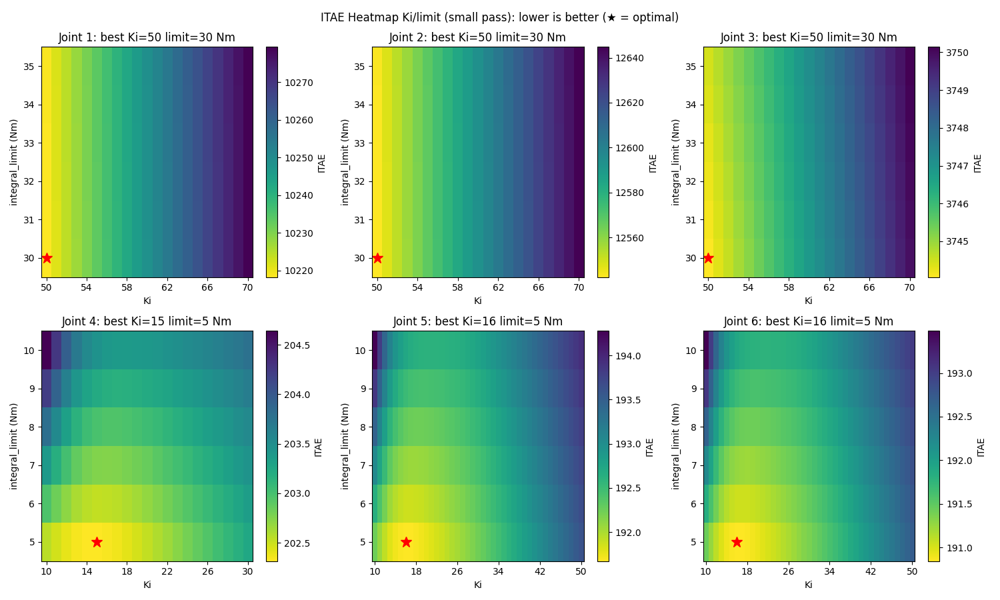
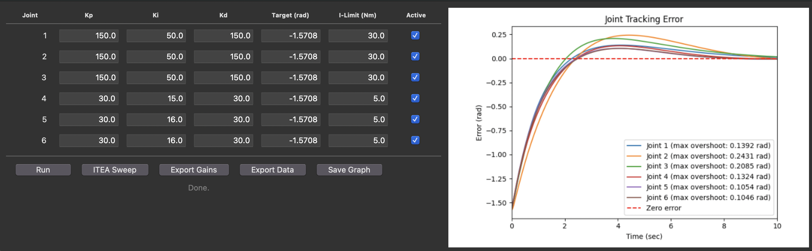

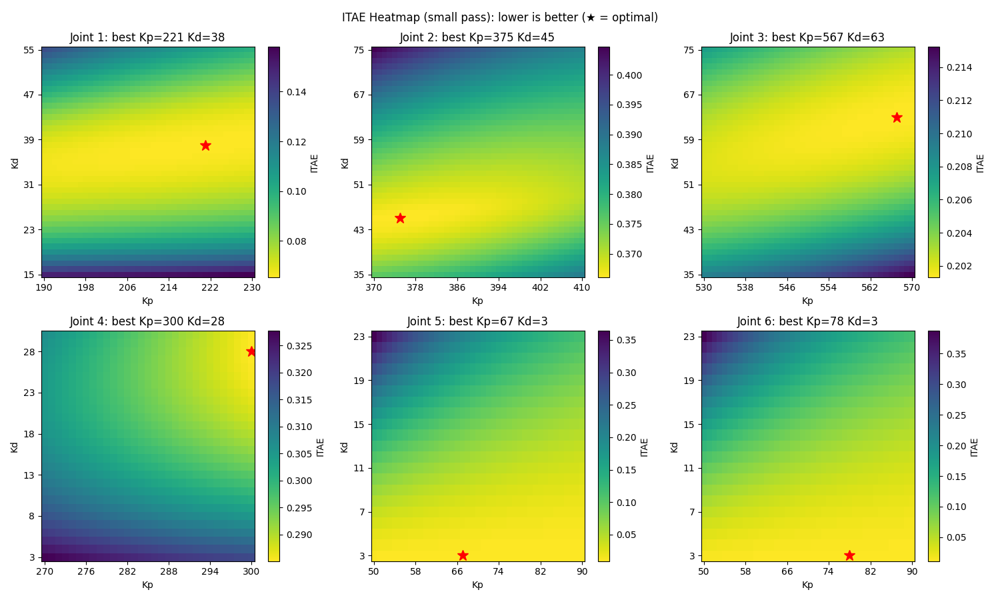
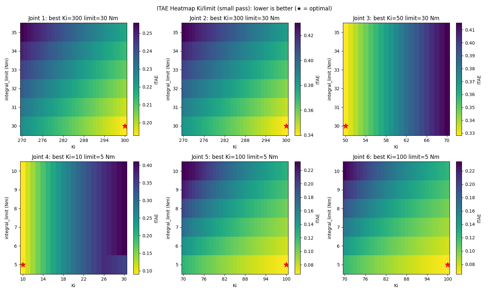

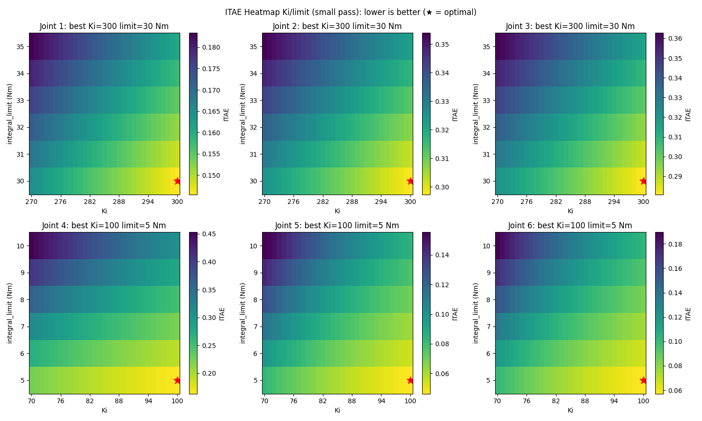
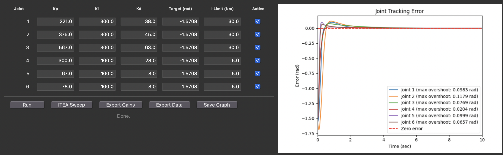

Although the overshoot problem improved and the steady state error was solved, there was still overshoot. Trying to improve one made the other problem worse. What tradeoff to favor depends on the task the robot is doing with these PID gains. For example with surgical robots, any amount of overshoot would not be acceptable as even a 1mm overshoot could contact areas of the task space like a blood vessel that should be be contacted. Surgical robots would reduce the Kp and incresase Kd to create a overdamped system where the arm would slowly reach the target position. Steady state error would not be acceptable in 3D printing because the layers of the printed object would not align leading to a useless printer.

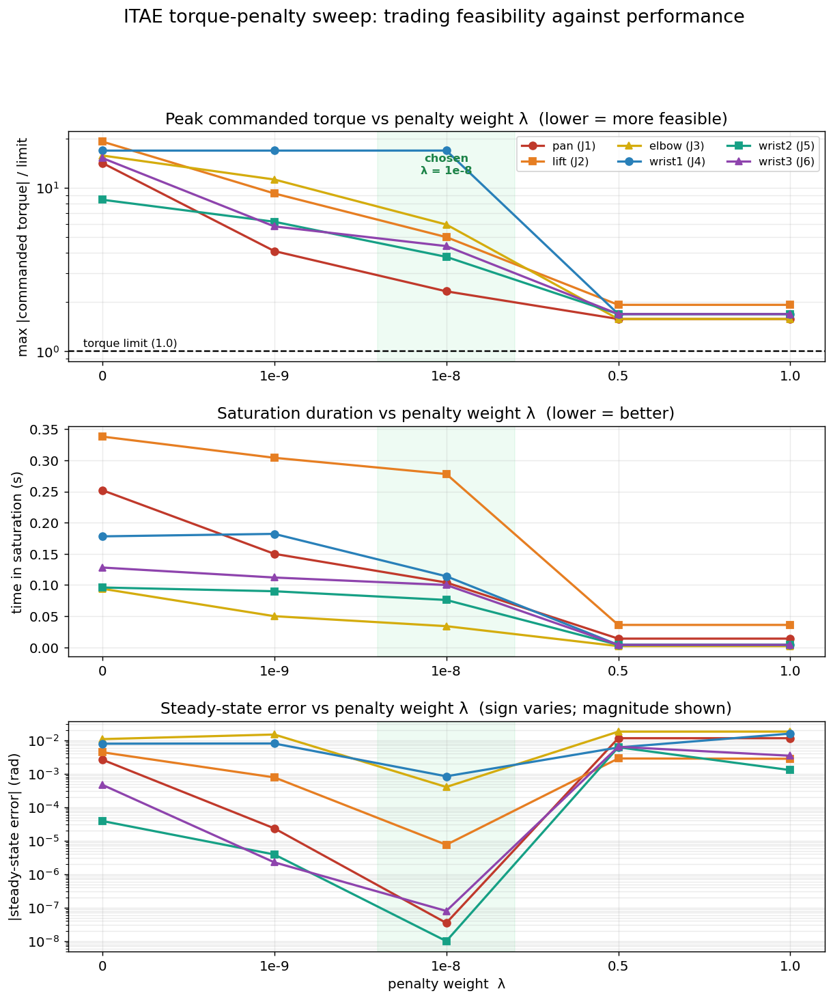

The steady state error caused in this specific configuration is caused by the lack of gravity compensation. One solution to this adding the data.qfrc_bias term to the final torque being applied. This gives compensation for both gravity and coriollis effects felt by the system. The fundamental equation explaining these effects is the following equation of motion for rigid objects.

M(q)q̈ + C(q,q̇)q̇ + g(q) = τ 

$M(q)$: The mass/inertia matrix. It represents the mass and rotational inertia of the robot. ($q$) dependent because a robot's inertia changes depending on its position ($q$). If you spin around with your arms tucked in, you rotate easily. If you extend your arms out wide, your rotational inertia increases, making it harder to spin.
$\ddot{q}$: Joint accelerations.
M(q)q̈: teh whole term represents the force/torque required to physically accelerate the robot's body parts from one speed to another, ignoring gravity and friction.

C(q,q̇): The Coriolis/Centrifugal Matrix. This is a coefficient matrix that represents how rotational forces interact with each other.
$\dot{q}$ (Velocity): The current speed of the joints.
C(q,q̇)q̇: The whole term represents the centrifugal force: the outward pull. If a robotic shoulder spins rapidly, the forearm is naturally slung outward away from the center, and also represents the coriolis force: the twisting force that happens when a link moves inward or outward while the whole system is spinning.

g(q): The Gravity Vector. This term represents exactly how much torque is pulling down on each joint due to the weight of the robot's own limbs at that exact posture.

Adding this term to applied torque showed much better performance when Ki = 0: solving both the steady state error and overshoot problems. In this particular configuration, Ki being equal to 0 having the best performance makes sense because the qfrc_bias is compensating for gravity, the exact reason the Ki gain was needed to fix steady state error.

## Conclusion

## remember to add the images

## saturation tradeoffs

## Links

https://www.youtube.com/watch?v=HYVPysAGp6g&t=325s  
https://www.youtube.com/watch?v=P83tKA1iz2Y&t=4s
https://www.youtube.com/watch?v=qj8vTO1eIHo&list=WL&index=2
https://www.youtube.com/watch?v=uXnDwojRb1g&list=WL&index=3
https://youtu.be/gpQDZ5CNY5w?si=Aa5Wt4vvjfdDK_0r
https://youtu.be/6Ji4vuJg2dw?si=dgxjJufpGfe7cc4X
https://youtu.be/YYxkS1iFdVk?si=a6eL5xT4WUgtfsc_
https://youtu.be/PRFCBVTFy90?si=L7evkppVRTE_NFfT
https://youtu.be/yRDAThIxoOg?si=5HWkS9ue_LV8GKEL
https://youtu.be/qC7hrYJVvD8?si=Nffi90eSMxpAK3Yj
https://youtu.be/6EcxGh1fyMw?si=tMLRfKGMMI3snw3v