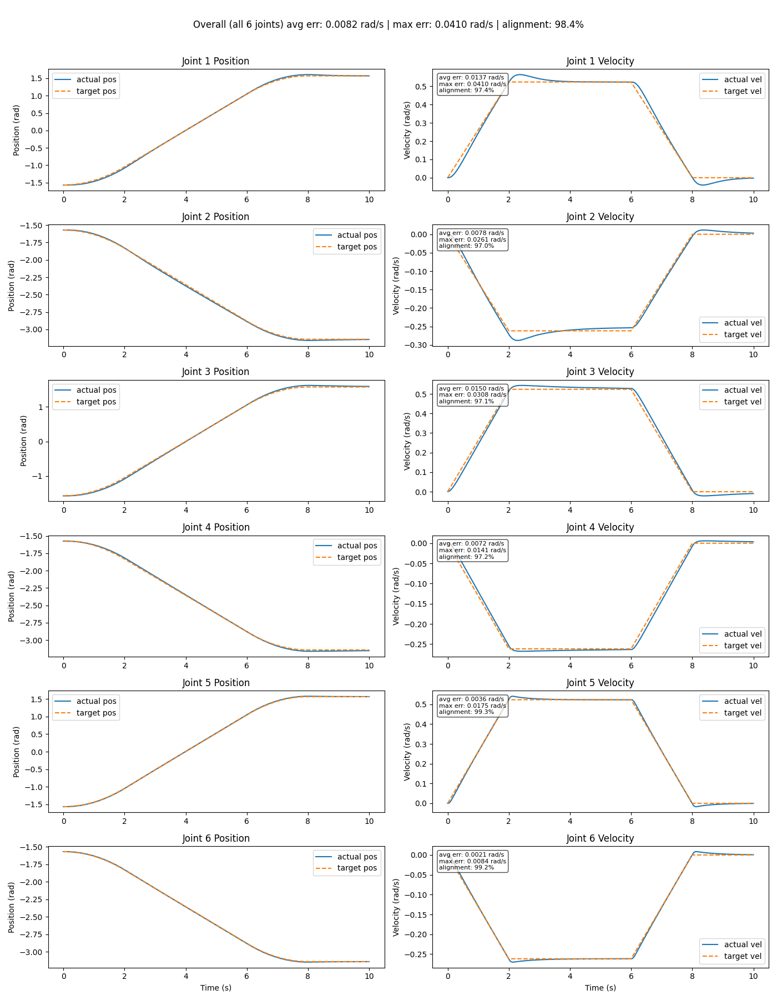
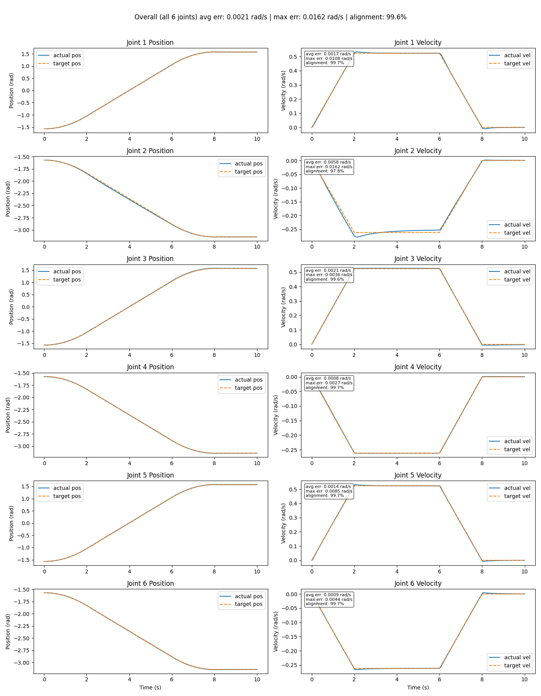
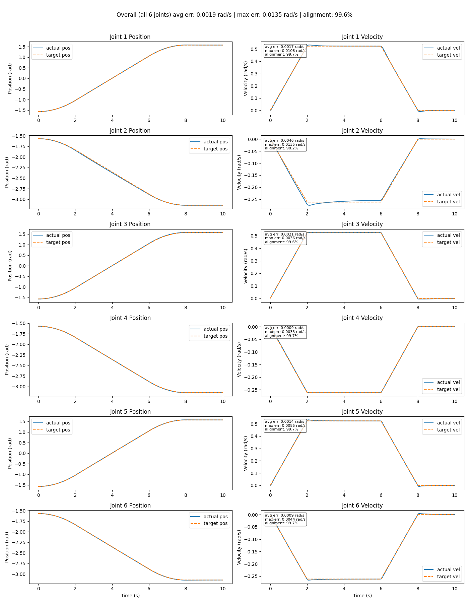
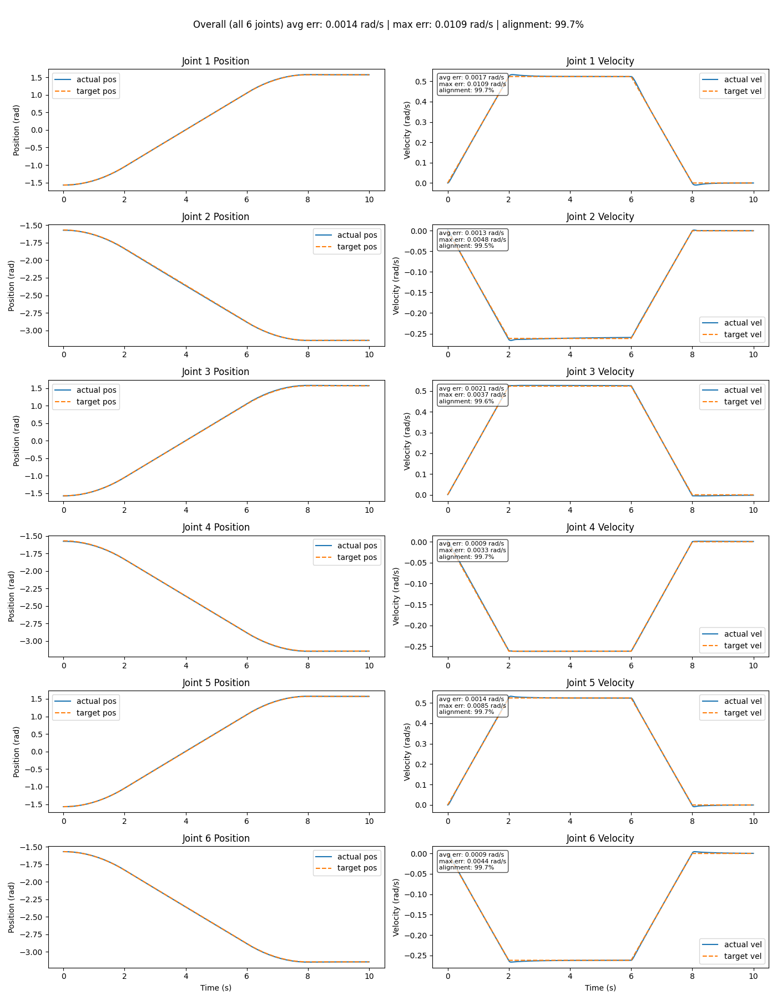

## Task 2 (Trajectory Tracking) Objectives

- Generate a smooth joint-space trajectory between two joint configurations.
- You can use either a trapezoidal velocity profile or a quintic polynomial trajectory.
- Then track that trajectory and plot the desired joint positions versus the actual joint positions.

## Mathematics

First, the generalized velocity equations for the joint-space trajectory using a trapezoidal velocity profile were formed.

$$
v(t) =
\begin{cases}
at, & 0 \le t < t_1 \\
b, & t_1 \le t < t_2 \\
-at + c, & t_2 \le t < t_3
\end{cases}
$$

By integrating these equations with respect to time, you are left with the model for positon.

$$
q(t) =
\begin{cases}
\dfrac{at^2}{2} + q(0), & 0 \le t < t_1 \\[6pt]
bt + \dfrac{at_1^2}{2} + q(0) - bt_1, & t_1 \le t < t_2 \\[6pt]
-\dfrac{at^2}{2} + ct + bt_2 + \dfrac{at_1^2}{2} + q(0) - bt_1 + \dfrac{at_2^2}{2} - ct_2, & t_2 \le t < t_3
\end{cases}
$$

Currently there are two problems with my first attempt. Firstly, the final integrated equations are not very readable and will be hard to debug. Secondly, because I chose the acceleration constant, a, and the deceleration constant, a negated, to be equal, these equations are not generalized.

I first wrote down some definitions.

$$
\text{area} = \frac{1}{2}t_1 v_{peak} + (t_2-t_1)v_{peak} + \frac{1}{2}(t_3-t_2)v_{peak}
$$

$$
\text{area} = v_{peak}\left[\frac{t_1}{2} + (t_2-t_1) + \frac{t_3-t_2}{2}\right], \qquad T_f = \frac{t_1}{2} + (t_2-t_1) + \frac{t_3-t_2}{2}
$$

$$
T_f \cdot v_{peak} = \text{target} - \text{init} \quad \text{(total displacement)}
$$

$$
v_{peak} = \frac{\text{target} - \text{init}}{T_f}
$$

I then looked at my constants to solve this generalization problem.
I noticed a is the acceleration constant:

$$
accel = \frac{v_{peak}}{t_1} \quad \text{(rise/run of the velocity graph)}
$$

And -a is the deceleration constant:

$$
decel = \frac{v_{peak}}{t_3 - t_2} \quad \text{(rise/run of the velocity graph)}
$$

This sucessesfully only uses the definitions provided and time parameters of t1-t3.

Looking at my first set of equations, much simplification could be performed with the initial value conditions such as position at t1 and t2.

$$
q(t_1) = q(0) + \frac{accel \cdot t_1^2}{2} \quad \text{(inital position is a variable)}
$$

$$
q(t_2) = q(t_1) + v_{peak}(t_2 - t_1)
$$

```
q(t) = self.init + accel * t ** 2 / 2, 0 <= t < t1
q(t) = pos_at_t1 + self.v_peak * (t - self.t1), t1 <= t < t2
q(t) = pos_at_t2 + self.v_peak * dt - decel * dt ** 2 / 2 #dt = t - self.t2
```

## Initial Testing

The inital and target positions were the following in radians:

```
init  = [-1.5708, -1.5708, -1.5708, -1.5708, -1.5708, -1.5708]
target = [1.5708, -3.1416, 1.5708, -3.1416, 1.5708, -3.1416]
```

With t1 - t3 as the following values in seconds

```
self.t1 = 2
self.t2 = 6
self.t3 = 8
```

Putting in the PID gains I found from Task 1, I graphed inital velocity trajectory graphs of each joint. The graph shows average error, max error, and with the help of AI, I normalized the average error against each joint's peak target velocity to make an alignment percentage equation.

$$
\text{alignment} = \max\!\left(0,\ 1 - \frac{\overline{err}}{v_{range}}\right) \times 100
$$

I didn't just want express'did it match or not the target velocity', I wanted the score to scale proportionally with how large the error was. Although this linear scaling is floored at 0% if the average error meets or exceeds the joint's own peak velocity range.".

Adding a position vs time graph was also a helpful visualization of how the robot is moving.



The first test showed relatively poor alignment to the velocity graph with a overall alignment of 98.4%.

## Feedforward

Pure feedback control is reactive: only produces torque once a tracking error already exists. When tracking a moving setpoint like the trapezoidal velocity profile, this means the loop has to build up a position error just to keep producing the torque needed to track a non-zero target velocity, which is the lag/error seen in Initial Testing.

The fix is setpoint/command feedforward architecture: since the target velocity is known analytically ahead of time (from `compute_tgt_vel`), it can be fed directly into the control signal in parallel with feedback, instead of relying on tracking error to reveal it after the fact. Feedback (`Kp`, `Ki`, and `- Kd*(curr_qvel)`) then only needs to correct for residual error and model mismatch, while feedforward (`Kv * target_qvel`) supplies the bulk of the torque the trajectory already tells us is needed.

$$u(t) = K_p e(t) + K_i \int_{0}^{t} e(\tau) d\tau + K_d \frac{de(t)}{dt} + K_v \dot{q}_{target}(t)$$

- https://apmonitor.com/pdc/index.php/Main/FeedforwardControl
- https://web.stanford.edu/class/archive/ee/ee392m/ee392m.1034/Lecture5_Feedfrwrd.pdf

The following was the result of the first feedback implementation.


Qualitative observations of the graph show much better alignment during the linear and constant sections of the trapazoidal trajectory; however, performance degrades at the trapezoid's corners (t1, t2, t3), where the acceleration changes discontinuously. These jerk discontinuities, for a moment, desynchronize the feedforward term from the system's actual achievable response. Quantitative observations show an improvement all around.

- Average error: 0.0082 rad/s -> 0.0021 rad/s
- Max error: 0.0410 rad/s -> 0.0162 rad/s
- Alignment: 98.4% -> 99.6%



At this point, I noticed the least performing joint was joint 2. The alignment of joint 2 was qualitatively and quantitatively worse than the other joints relatively (97.8% compared to ~99.7 of other joints).

I suspected this was due to joint 2 was carrying the rest of the arm and fighting against gravity. One solution is increasing the Kp and Ki gains of joint 2. Higher Kp means the controller decreases the required amount of error needed for the same load torque. Higher Ki will keep accumulating residual error over time and add torque until there is no sag from joint 2.

Increasing Kp from 375 to 475 and Ki from 300 to 350 gave marginally better results.



I continuously increased Kp and Ki until I no longer saw improvement. This was at Kp = 1575 and Ki = 900 where joint 2 performance nearly matched that of the other joints.



The problem with high Kp and Ki values is possible system instability to small errors and external noise in real world scenerios; although this was not seen in simulation.

## Conclusion

Task 2 generalized the trapezoidal velocity profile from Task 1's fixed-coefficient implementation into a reusable model, then used it to track a full joint-space trajectory between two joint configurations.

Pure PID feedback alone produced a reactive lag (98.4% overall alignment), since the loop needed a buildup of error before it could supply torque for a moving target. Adding command/setpoint feedforward (`Kv * target_qvel`) closed most of that gap (99.6%) by supplying the expected torque ahead of time rather than waiting on error, leaving the corners of the trapezoid (where commanded acceleration is discontinuous) as the main remaining source of error.

Joint 2 stood out as the weakest performer because it carries the rest of the arm's weight against gravity, and feedback alone needs a position sag to generate enough holding torque. Increasing Kp and Ki for that joint specifically closed nearly all of the remaining gap, at the cost of gains that would be riskier for noise/instability on real hardware than they are in simulation.

## Links

- https://www.youtube.com/watch?v=-oGNxB86YEk
