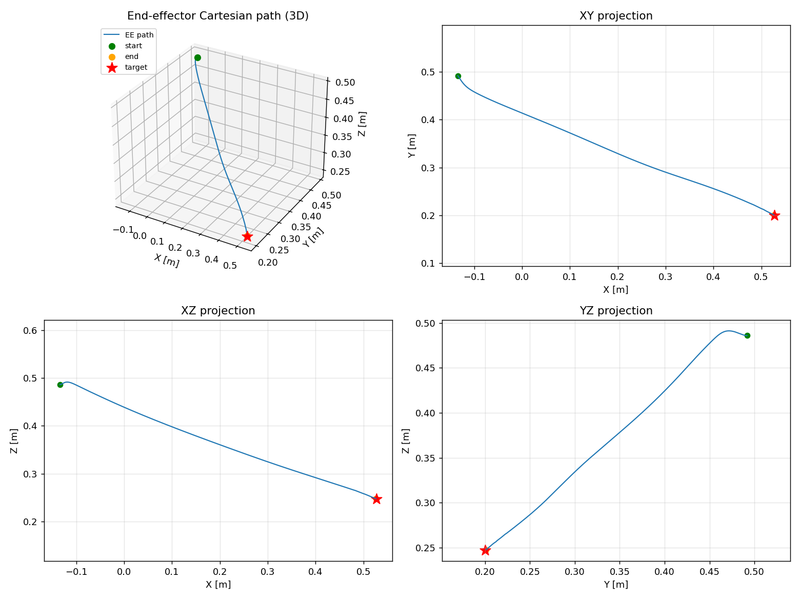
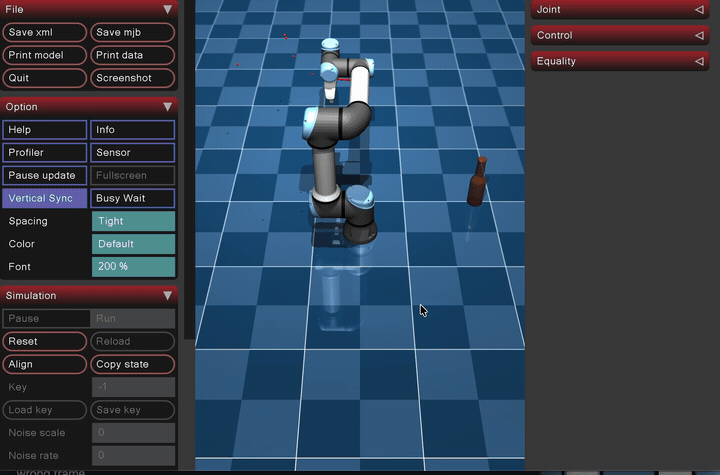

## Task 3 (Jacobian) Objectives

- Using inverse kinematics or a Jacobian-based resolved-rate control approach, move the end-effector toward the CAD object you created.
- If possible, also visualize the Cartesian path of the end-effector.
## Step 1 (Forward Kinematics)
 
### Denavit-Hartenberg Convention
 
A robot arm consists of rigid links that are connected by joints. In forward kinematics, a coordinate frame is placed onto each link (x, y, z axis).
The process of foward kinematics allows you to find the cartesian coordinates of a end effector of the UR5e arm based off of joint angles (theta) and link lengths (m).
 
In general, relating one frame to another in 3D takes 6 numbers (3 position, 3 orientation). However, the Denavit-Hartenberg convention aligns each frame's z-aix with its joint's rotation axis and its x axis along the common perpendicular to the next joint, therefore, allowing us to use only 4 numbers to describe how to travel from frame i - 1 to frame i.
 
- **θᵢ**: rotate about z. For a revolute joint this is the joint angle: what the motor turns.
- **dᵢ**: slide along z (the link offset, how far the next joint is stacked along this axis).
- **aᵢ**: slide along x (the link length, how far the next joint reaches sideways).
- **αᵢ**: rotate about x (the link twist, how much the next joint's axis is tilted relative to this one).
This information was gathered from a UR5e datasheet and organized into the table below. The only variable that changes as the robot moves is the joint position θ; d, a, and α are fixed constants set by the robot's geometry.
 
**DH parameter table**
 
| Joint i | θᵢ | dᵢ | aᵢ | αᵢ |
|---------|------|--------|---------|------|
| 1 | θ0 | 0.1625 | 0 | 90° |
| 2 | θ1 | 0 | −0.425 | 0° |
| 3 | θ2 | 0 | −0.3922 | 0° |
| 4 | θ3 | 0.1333 | 0 | 90° |
| 5 | θ4 | 0.0997 | 0 | −90° |
| 6 | θ5 | 0.0996 | 0 | 0° |
 
[UR5e DH Parameters: Universal Robots](https://www.universal-robots.com/articles/ur/application-installation/dh-parameters-for-calculations-of-kinematics-and-dynamics/)
 
### Elementary Transformation
 
Traveling from one joint's frame to the next happens in four simple steps. Each of the four DH parameters corresponds to one elementary transform, a basic rotation or translation written as a 4×4 matrix so that a rotation and a translation can ride in the same object. Multiplying the four elementary transforms together gives the single "hop" $T_{i-1}^{\,i}$ from frame $i-1$ to frame $i$.
 
To keep the matrices readable, let Cθ = cos θ, Sθ = sin θ, Cα = cos α, Sα = sin α.
 
```math
T_{i-1}^{\,i} = \text{Rot}_z(\theta)\;\text{Trans}_z(d)\;\text{Trans}_x(a)\;\text{Rot}_x(\alpha)
```
 
Read left to right, the four moves are:
 
**Rotₓ z(θ)**: rotation about z by the joint angle. This is the only one of the four that changes while the robot runs, since it is what the motor actually turns:
 
```math
\text{Rot}_z(\theta)=\begin{bmatrix} C\theta & -S\theta & 0 & 0\\ S\theta & C\theta & 0 & 0\\ 0 & 0 & 1 & 0\\ 0 & 0 & 0 & 1 \end{bmatrix}
```
 
**Transz(d)**: translation along z by the link offset, stacking the next joint up along the axis:
 
```math
\text{Trans}_z(d)=\begin{bmatrix} 1 & 0 & 0 & 0\\ 0 & 1 & 0 & 0\\ 0 & 0 & 1 & d\\ 0 & 0 & 0 & 1 \end{bmatrix}
```
 
**Transₓ(a)**: translation along x by the link length, reaching out to where the next joint sits:
 
```math
\text{Trans}_x(a)=\begin{bmatrix} 1 & 0 & 0 & a\\ 0 & 1 & 0 & 0\\ 0 & 0 & 1 & 0\\ 0 & 0 & 0 & 1 \end{bmatrix}
```
 
**Rotₓ(α)**: rotation about x by the link twist, tilting the frame so its z axis lines up with the next joint's spin axis:
 
```math
\text{Rot}_x(\alpha)=\begin{bmatrix} 1 & 0 & 0 & 0\\ 0 & C\alpha & -S\alpha & 0\\ 0 & S\alpha & C\alpha & 0\\ 0 & 0 & 0 & 1 \end{bmatrix}
```
 
Doing all four in order and multiplying them out collapses to one matrix. Its top-left 3×3 block is the rotation and its right-hand column is the position, so this single $T_{i-1}^{\,i}$ carries both how the next frame is turned and where it sits:
 
```math
T_{i-1}^{\,i}=\begin{bmatrix} C\theta & -S\theta\,C\alpha & S\theta\,S\alpha & a\,C\theta\\ S\theta & C\theta\,C\alpha & -C\theta\,S\alpha & a\,S\theta\\ 0 & S\alpha & C\alpha & d\\ 0 & 0 & 0 & 1 \end{bmatrix}
```
 
### Chaining Transformations Together For Forward Kinematics
 
A single elementary transform only carries you one joint forward. To reach the flange from the base you ride the entire chain, multiplying the hops together in the order you meet them. Building that up one product at a time gives the cumulative products:
 
```math
\begin{aligned}
T_0^{\,2} &= T_0^{\,1}\,T_1^{\,2} \\
T_0^{\,3} &= T_0^{\,2}\,T_2^{\,3} \\
&\;\vdots \\
T_0^{\,6} &= T_0^{\,5}\,T_5^{\,6}
\end{aligned}
```
 
$T_0^{\,1}$: "the transform from frame 0 to frame 1"
 
Where:
 
- $T_{i-1}^{\,i}$ is an elementary step, one joint to the next.
- $T_0^{\,i}$ is a cumulative transform, the base all the way out to frame $i$.

Stacking all six elementary steps gives the transform from the base to the flange:
```math
T_0^{\,6} = T_0^{\,1}\,T_1^{\,2}\,T_2^{\,3}\,T_3^{\,4}\,T_4^{\,5}\,T_5^{\,6}
```
 
Every cumulative transform has the same shape, a rotation block sitting next to a position column:
 
```math
T_0^{\,i} = \left[\begin{array}{c|c} R_0^{\,i} & P_i \\\hline \mathbf{0}^\top & 1 \end{array}\right]
```
 
- Column 1 → frame *i*'s x-axis
- Column 2 → frame *i*'s y-axis
- Column 3 → frame *i*'s z-axis = $z_i$
- Column 4 → the origin $p_i$

For the final frame, the right-hand column is $p_e$, the end effector position in Cartesian coordinates measured in meters, and the top-left 3x3 block is $R_e$, which describes the end effector's orientation. Column 3, the frame's z-axis $z_i$ is the axis that joint $i$ spins about.
 
### Validating the FK against MuJoCo

My FK builds $T_0^{\,6}$ in my own DH base frame, but the IK target is read out of MuJoCo (e.g. `data.geom_xpos` / `data.site_xpos`), which lives in the MuJoCo world frame. If those two frames don't actually describe the same physical point in the same coordinates, every error vector $e = p_{target} - p_e$ is wrong, and the arm would chase a ghost target even with perfectly correct math.

A second trap is comparing the wrong frame. My DH chain ends at the flange (frame 6), while MuJoCo's `attachment_site` could carry an extra tool offset or rotation. Comparing the flange against a site that has been pushed forward by a tool would show a constant position gap that is *just a frame-definition difference, not an FK bug*: and chasing that "error" would put the math in a loop.

`validate_fk()` (called once at startup in `jacobian.py`) validates these problems don't exist. For the current configuration plus four random joint configurations it:

1. writes the joints into `data.qpos[:6]` and calls `mujoco.mj_forward` so MuJoCo reports the true frame positions for that pose,
2. computes my DH world position $p_e$ for the same `qpos`,
3. measures the Euclidean residual against the `attachment_site` and the `wrist_3_link` body: and prints each, so any offset between flange and tool is shown,
4. shows the worst residual stays under a 2 mm tolerance, then restores the original state.

```math
\text{residual} = \lVert\, p_e^{\text{DH}} - p^{\text{MuJoCo}} \,\rVert < 2\ \text{mm}
```

This confirms two things: the DH chain and MuJoCo agree on where the end-effector is, and on this model the `attachment_site` sits right at the flange with no extra tool offset.

## Step 2 (Error)
 
Forward kinematics gives me the current end effector position $p_e$. The next thing the controller needs is how far that is from the target, which is the straight-line difference between where I want the tool and where it is right now:
 
$$e = p_{target} - p_e$$
 
This error vector points from the current position toward the target, so it also tells the tool which way to head. Its length says how much ground is left to cover:
 
$$\lVert e \rVert = \sqrt{e_x^2 + e_y^2 + e_z^2}$$
 
Once that magnitude drops below a small tolerance, the tool has arrived and the loop can stop.
 
## Step 3 (Jacobian)
 
### Build $J_v$
 
The Jacobian is the bridge between joint speeds and tool speed. It answers: if I spin this joint a little, which way and how fast does the end effector move? For a revolute joint the answer is a cross product, and each column of the linear-velocity Jacobian is:
 
```math
\text{column}_i \;=\; \mathbf{z}_{i-1} \times (\mathbf{p}_e - \mathbf{p}_{i-1})
```
 
```math
J_v =
\begin{bmatrix}
\mathbf{z}_0 \times (\mathbf{p}_e - \mathbf{p}_0)
& \cdots &
\mathbf{z}_5 \times (\mathbf{p}_e - \mathbf{p}_5)
\end{bmatrix}
```
 
Where:

- $\mathbf{z}_{i-1}$ is the axis joint $i$ spins about, which is column 3 of that joint's cumulative transform from Step 1.
- $\mathbf{p}_e - \mathbf{p}_{i-1}$ is the lever arm, the vector reaching from the joint out to the tool.

The cross product captures the everyday fact that spinning a joint swings the tool in a circle around that joint's axis. The further out the tool sits, the longer the lever arm and the faster it sweeps, and it always moves at a right angle to both the axis and the arm. Stacking one such column per joint gives $J_v$, which is $3 \times 6$: three rows for the x, y, z of tool velocity, and one column per joint.
 
---
 
## Step 4: Damped Least-Squares Solve
 
The goal is to solve $J_v \Delta\theta = \Delta p$ for the joint step $\Delta\theta$, but in a way that picks one answer out of many and stays stable near singularities.
 
### Why we can't just invert
 
```math
J\,\Delta\theta = \Delta p \quad\Longrightarrow\quad \Delta\theta = J^{-1}\,\Delta p \;\; \color{red}{\times}
```
 
The problem is that $J$ is a $3 \times 6$ matrix, so it is not square and has no inverse. There are 3 equations (the x, y, z of the tool) and 6 unknowns (the six joints), so infinitely many different joint motions land the tool in the exact same spot. The arm is redundant, and I have to choose one of those motions.
 
To choose, I search only in the slice of joint space the Jacobian actually uses, its row space, by writing the answer as:
 
```math
\Delta\theta = J^{\mathsf{T}} w
```
 
> Writing $\Delta\theta = J^{\mathsf{T}} w$ automatically discards the wasted internal motions and keeps the smallest (minimum-norm) joint step that still does the job. Here $w$ is a 3-vector I have left to solve for.
 
Substituting that back collapses the wide, unsolvable system into a small square one I can actually invert:
 
```math
J(J^{\mathsf{T}} w) = \Delta p \;\Longrightarrow\; (J J^{\mathsf{T}})\,w = \Delta p \;\Longrightarrow\; w = (J J^{\mathsf{T}})^{-1}\,\Delta p
```
 
```math
\Delta\theta = J^{\mathsf{T}} w = J^{\mathsf{T}} (J J^{\mathsf{T}})^{-1}\,\Delta p \qquad (\text{pseudoinverse})
```
 
---
 
### Algorithm
 
**a) Inputs**
 
$J_v$ comes from Step 3. The task-space step $\Delta p$ is the error from Step 2 scaled down by a step size $\alpha$, so the arm moves a measured fraction of the way on each iteration instead of lunging the whole distance at once:
 
```math
\Delta p = \alpha\, e = 0.5 \begin{bmatrix} \,\cdot\, \\ \,\cdot\, \\ \,\cdot\, \end{bmatrix}
```
 
**b) Form the damped normal matrix**
 
```math
A = J_v J_v^{\mathsf{T}} + \lambda^2 I \qquad [\,3 \times 3\,], \quad \lambda^2 \approx 0.0025
```
 
Multiplying $J_v$ by its transpose makes a small $3 \times 3$ matrix that can be inverted. The $\lambda^2 I$ term is the damping: near a singularity $J_v J_v^{\mathsf{T}}$ becomes nearly singular and would produce a very large $\Delta\theta$, so adding a little to the diagonal bounds the step at the price of a slightly shorter one.
 
**c) Solve for $y$**
 
```math
y = A^{-1}\,\Delta p \qquad [3 \times 3][3 \times 1] \Rightarrow [3 \times 1]
```
 
**d) Map back to joint space**
 
```math
\Delta\theta = J_v^{\mathsf{T}}\, y \qquad [6 \times 3][3 \times 1] \Rightarrow [6 \times 1]
```
 
**e) Update the joint angles**
 
```math
\theta_{\text{new}} = \theta_{\text{old}} + \Delta\theta
```
 
---
 
## The Pseudoinverse (Moore-Penrose inverse)
 
```math
J^{+} = J^{\mathsf{T}} (J J^{\mathsf{T}})^{-1}
```
 
The expression $J^{\mathsf{T}} (J J^{\mathsf{T}})^{-1}$ that fell out of the solve above is the Moore-Penrose pseudoinverse, written $J^{+}$. A few things worth knowing about it:

- It is a generalization of a matrix inverse to matrices that are not square.
- It is used when a system of linear equations $A x = b$ does not have a unique solution, where it provides the best-fit approximate solution.
- It computes the minimum-norm least-squares solution, the smallest answer that still gets as close as possible.
 
```math
\Delta\theta = J^{\mathsf{T}} (J J^{\mathsf{T}} + \lambda^2 I)^{-1}\,\Delta p
```


## Full Jacobian (6x6) Implementation
 
As mentioned above, the Jacobian matrix used was only a 3x6 Jacobian which only contains information needed for position, not orientation. The following are the differences and additions I made to the algorithm to support the full 6x6 Jacobian matrix.
 
Moving from the $3 \times 6$ to the full $6 \times 6$ Jacobian adds **orientation** control, so the end-effector is driven to a full target *pose* (position **and** orientation) instead of just a target point. This changes three things: the error becomes a 6-vector, the Jacobian gains three orientation rows, and the damped least-squares solve grows from $3 \times 3$ to $6 \times 6$. The steps below describe only the differences and additions from the position-only version above.
 
### Step 1 (Forward Kinematics): addition
 
No new computation is needed here. The orientation $R_e$ is the top-left $3 \times 3$ block of $T_0^{\,6}$, which was already produced in the original Step 1 but went unused. For the full Jacobian I now keep it:
 
```math
R_e = T_0^{\,6}[\,0\!:\!3,\;0\!:\!3\,]
```
 
Its three columns are the end-effector frame's $\mathbf{x}$, $\mathbf{y}$, $\mathbf{z}$ axes expressed in the base frame.
 
### Step 2 (Error): now a 6-vector pose error
 
The error from the original Step 2 becomes the **position** part of a larger error, renamed $e_p$:
 
```math
e_p = p_{target} - p_e \qquad [3 \times 1]
```
 
A second **orientation** part $e_o$ is added. This requires a target orientation $R_d$ (the desired tool orientation). Because orientations cannot be subtracted, I first compute the rotation that carries the current orientation onto the desired one:
 
```math
R_{err} = R_d\,R_e^{\mathsf{T}} \qquad [3 \times 3]
```
 
$R_{err}$ is a full rotation matrix. Euler's rotation theorem says any rotation, no matter how it is built, is the same as a single turn of some angle $\phi$ about some axis. Pulling that one axis and angle back out turns the matrix into a rotation vector (axis × angle), the angular analog of $p_{target} - p_e$: it points along the axis the tool must twist about, and its length is how far. The angle comes from the trace:
 
```math
\phi = \arccos\!\left(\frac{\mathrm{tr}(R_{err}) - 1}{2}\right)
```
 
```math
e_o = \frac{\phi}{2\sin\phi}
\begin{bmatrix}
R_{err}[3,2] - R_{err}[2,3] \\
R_{err}[1,3] - R_{err}[3,1] \\
R_{err}[2,1] - R_{err}[1,2]
\end{bmatrix}
\qquad [3 \times 1]
```
 
The position and orientation parts are stacked into a single $6 \times 1$ pose error, each scaled by its own gain:
 
```math
e =
\begin{bmatrix}
K_p\,e_p \\
K_o\,e_o
\end{bmatrix}
\qquad [6 \times 1]
```
 
The two gains are needed because $e_p$ is in **meters** and $e_o$ is in **radians**; $K_p$ and $K_o$ weight the two so neither dominates the step. ($K_p$ plays the same role the step size $\alpha = 0.5$ did in the position-only version.)

https://en.wikipedia.org/wiki/Axis%E2%80%93angle_representation
https://en.wikipedia.org/wiki/Euler%27s_rotation_theorem
 
### Step 3 (Jacobian): add the orientation rows
 
The original $J_v$ becomes the **top three rows**. I add a second block $J_\omega$ (the angular-velocity Jacobian) whose columns are simply the joint axes. The reasoning: spinning a revolute joint tumbles the tool about that joint's own axis, so the angular contribution of joint $i$ is just its axis $\mathbf{z}_{i-1}$, with no lever arm and no cross product needed:
 
```math
\text{column}_i \;=\; \mathbf{z}_{i-1}
```
 
```math
J_\omega =
\begin{bmatrix}
\mathbf{z}_0 & \cdots & \mathbf{z}_5
\end{bmatrix}
\qquad [3 \times 6]
```
 
Stacking the linear and angular blocks gives the full Jacobian, where each column is the complete twist (slide stacked on tumble) produced by spinning that joint:
 
```math
\text{column}_i \;=\;
\begin{bmatrix}
\mathbf{z}_{i-1} \times (\mathbf{p}_e - \mathbf{p}_{i-1}) \\
\mathbf{z}_{i-1}
\end{bmatrix}
```
 
```math
J =
\begin{bmatrix}
J_v \\
J_\omega
\end{bmatrix}
\qquad [6 \times 6]
```
 
This $J$ now maps joint rates to the full end-effector twist (linear velocity $v$ stacked on angular velocity $\omega$):
 
```math
\begin{bmatrix} v \\ \omega \end{bmatrix} = J\,\dot{\theta}
\qquad [6 \times 1] = [6 \times 6][6 \times 1]
```
 
## Step 4: Damped Least-Squares Solve (6x6): same formula, larger dimensions
 
The solve is structurally identical to the position-only version; only the dimensions grow.
 
**a) Inputs**
 
$J$ is now $6 \times 6$, and the task-space error is the full $6 \times 1$ pose error from Step 2:
 
```math
e =
\begin{bmatrix}
K_p\,e_p \\
K_o\,e_o
\end{bmatrix}
\qquad [6 \times 1]
```
 
**b) Form the damped normal matrix**
 
```math
A = J\,J^{\mathsf{T}} + \lambda^2 I \qquad [\,6 \times 6\,], \quad \lambda^2 \approx 0.0025
```
 
**c) Solve for $y$**
 
```math
y = A^{-1}\,e \qquad [6 \times 6][6 \times 1] \Rightarrow [6 \times 1]
```
 
**d) Map back to joint space**
 
```math
\Delta\theta = J^{\mathsf{T}}\,y \qquad [6 \times 6][6 \times 1] \Rightarrow [6 \times 1]
```
 
**e) Update the joint angles**
 
```math
\theta_{\text{new}} = \theta_{\text{old}} + \Delta\theta
```
 
Because $J$ is now square ($6 \times 6$), at a non-singular configuration the damped pseudoinverse reduces to the plain inverse $\Delta\theta = J^{-1} e$. I keep the $\lambda^2 I$ damping anyway, since a full-pose target makes the arm pass near wrist and shoulder singularities more often, and the damping is what keeps $\Delta\theta$ bounded when it does.
 
### Step 5 Convergence
 
Because the error now has two parts in two different units, the stopping test checks each separately:
 
```math
\lVert e_p \rVert < \text{pos\_tol}
\quad\text{and}\quad
\lVert e_o \rVert < \text{rot\_tol}
```
 
When both are satisfied, the current $\theta$ places the end-effector at the full target pose. Otherwise the loop returns to Step 1 and re-linearizes at the updated configuration.

## Full Pose (6x6) Demo

The full 6×6 Jacobian driving the end-effector to the target pose (position and orientation):


## Adding a Gripper (Franka Panda Hand)

So far the IK drives the bare flange (the `attachment_site` at the tip of `wrist_3_link`) to the target. To let the arm actually pick up the bottle, I mounted a gripper on the end-effector. The model is the Franka Panda parallel-jaw hand, taken from Google DeepMind's MuJoCo Menagerie.

https://github.com/google-deepmind/mujoco_menagerie/tree/main/franka_emika_panda

### Sourcing the model

I started with a Robotiq 3-Finger gripper, but a three-finger hand is hard to close reliably on a round object, and the only source for it was a URDF that needed translating into MJCF by hand. The Panda hand solves both problems. It is already written in MJCF, so it drops straight into `ur5e.xml`, and it is a simple parallel-jaw design: two fingers on prismatic (slide) joints with flat box pads, the same gripper MuJoCo uses in its own grasping demos. Flat pads squeezing in a straight line grasp far more dependably than three curling fingers.

Because both models are MJCF, the only conflicts to clear up were shared names. The UR5e and the Panda both define a `black` material and `visual` and `collision` default classes, and MJCF names are global, so the Panda's were renamed to `panda_black`, `panda_visual`, and `panda_collision` to keep the two from colliding.



## Grabbing the Bottle

With the hand mounted, I run a three-phase finite state machine:

- **reach**: IK drives the grip point to the bottle. The gripper starts open (`data.ctrl[grip_id] = 255`; on this actuator `255 = open`, `0 = closed`).
- **close**: once both `e_p` and `e_o` are under tolerance, the gripper closes (`data.ctrl[grip_id] = 0`) and holds for 2 s so the contact can settle before any motion.
- **return**: IK drives the loaded hand back to the home pose.

### Aiming at the right point on the bottle

The IK solves for a full pose, so the grasp needs both a target **position** and a target **orientation**.

`bottle_grasp_target()` reads the bottle's bounding box and returns a point a chosen fraction up its height (`height_frac`), on the central axis. The grip point itself is the flange position pushed forward by a fixed `GRIP_OFFSET` along the tool's approach axis.

The target orientation `R_d` is a side of the bottle grasp: the gripper's approach axis (the tool's local +z, where the fingers point) is aimed horizontally at the bottle (+x), and the jaws close in the horizontal plane:

```math
R_d =
\begin{bmatrix}
0 & 0 & 1\\
0 & 1 & 0\\
-1 & 0 & 0
\end{bmatrix}
```

### Problem: the bottle kept slipping out

The first attempts grasped fine while stationary but lost the bottle as soon as the arm moved. There were three separate issues:

**1. Grasp height.** Grabbing high on the bottle (near the top/neck) puts the grip far above the center of mass, so gravity hangs the whole bottle off the contact as a pendulum and pivots it loose. Gripping nearer the wide body, close to the center of mass, removes that lever arm.

**2. Contact friction.** The fingertip pads defaulted to `condim=3` (sliding friction only) with `μ = 1.0`, so nothing resisted the bottle twisting in the jaws. The pad collision class now uses `condim=6` (adds torsional + rolling friction), `friction="5.0 0.2 0.01"`, and `priority="2"` so the contact takes the grippy pad values instead of combining with the bottle's lower defaults.

**3. Grip force** Even with high friction the bottle still crept loose, because friction force is `μ × N` and the squeeze force `N` was small. The Panda gripper is a position servo, and on a thin object the fingers nearly close, so the position error is very small: the contact normal force measured only **~0.9 N**, against a bottle weight of `0.4 kg × 9.81 ≈ 3.9 N`. The fix was to stiffen the servo by scaling its gain and position bias together by 10×, and to cap `forcerange` at the real Franka Hand spec of ±140 N tendon force (~ 70 N per jaw):

```xml
<general class="panda" name="gripper" tendon="split" forcerange="-140 140" ctrlrange="0 255"
  gainprm="0.1568627451 0 0" biasprm="0 -1000 -100"/>
```

After stiffening, the same grasp holds the bottle with **~14 N per jaw** (well under the 70 N ceiling, so it never saturates), and the contact normal force rises from ~0.9 N to ~9 N. With ~14 N of squeeze and `μ = 5.0`, the available holding force is far above the bottle's weight, and it no longer slips during the reach, lift, or return.

