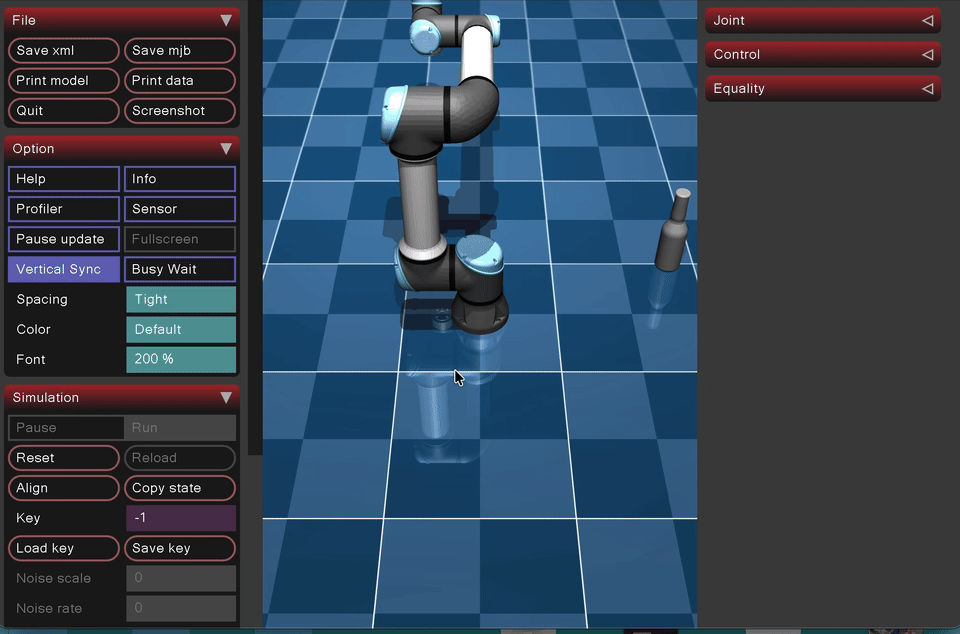
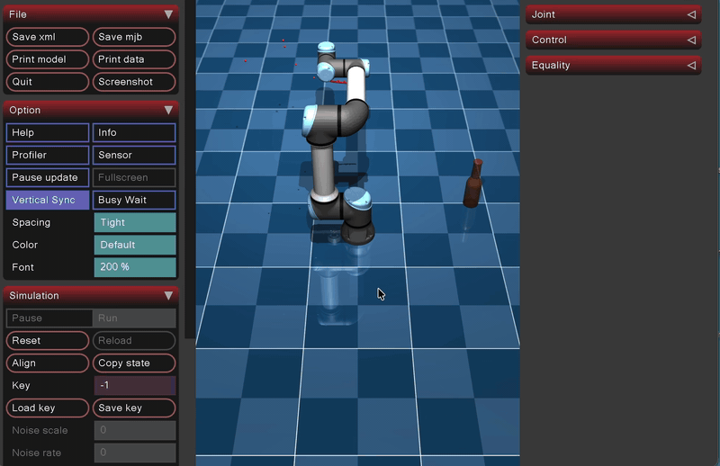

## Task 3 (Jacobian) Objectives

- Using inverse kinematics or a Jacobian-based resolved-rate control approach, move the end-effector toward the CAD object you created.
- If possible, also visualize the Cartesian path of the end-effector.
## Step 1 (Forward Kinematics)
 
### Denavit-Hartenberg Convention
 
A robot arm consists of rigid links that are connected by joints. In forward kinematics, a coordinate frame is placed onto each link (x, y, z axis).
The process of foward kinematics allows you to find the cartesian coordinates of a end effector of the UR5e arm based off of joint angles (theta) and link lengths (m).
 
In general, relating one frame to another in 3D takes 6 numbers (3 position, 3 orientation). However, the Denavit-Hartenberg convention aligns each frame's z-aix with its joint's rotation axis and its x axis along the common perpendicular to the next joint, therefore, allowing us to use only 4 numbers to describe how to travel from frame i - 1 to frame i.
 
- **θᵢ**: rotate about z. For a revolute joint this is the joint angle: what the motor turns.
- **dᵢ**: slide along z (the link offset, how far the next joint is stacked along this axis).
- **aᵢ**: slide along x (the link length, how far the next joint reaches sideways).
- **αᵢ**: rotate about x (the link twist, how much the next joint's axis is tilted relative to this one).
This information what gathered from a UR5e datasheet and organize in a table. From this table, the only changing variable is the joint position(theta). d, a and alpha are constants.
 
**DH parameter table**
 
| Joint i | θᵢ | dᵢ | aᵢ | αᵢ |
|---------|------|--------|---------|------|
| 1 | θ0 | 0.1625 | 0 | 90° |
| 2 | θ1 | 0 | −0.425 | 0° |
| 3 | θ2 | 0 | −0.3922 | 0° |
| 4 | θ3 | 0.1333 | 0 | 90° |
| 5 | θ4 | 0.0997 | 0 | −90° |
| 6 | θ5 | 0.0996 | 0 | 0° |
 
[UR5e DH Parameters: Universal Robots](https://www.universal-robots.com/articles/ur/application-installation/dh-parameters-for-calculations-of-kinematics-and-dynamics/)
 
### Elementary Transformation
 
Each of the four parameters corresponds to one elementary transform which is a basic rotation or translation described as a 4×4 matrix.
 
Cθ = cos θ, Sθ = sin θ, Cα = cos α, Sα = sin α.
 
```math
T_{i-1}^{\,i} = \text{Rot}_z(\theta)\;\text{Trans}_z(d)\;\text{Trans}_x(a)\;\text{Rot}_x(\alpha)
```
 
The four matrices are:
 
**Rotₓ z(θ)**: rotation about z by the joint angle:
 
```math
\text{Rot}_z(\theta)=\begin{bmatrix} C\theta & -S\theta & 0 & 0\\ S\theta & C\theta & 0 & 0\\ 0 & 0 & 1 & 0\\ 0 & 0 & 0 & 1 \end{bmatrix}
```
 
**Transz(d)**: translation along z by the link offset:
 
```math
\text{Trans}_z(d)=\begin{bmatrix} 1 & 0 & 0 & 0\\ 0 & 1 & 0 & 0\\ 0 & 0 & 1 & d\\ 0 & 0 & 0 & 1 \end{bmatrix}
```
 
**Transₓ(a)**: translation along x by the link length:
 
```math
\text{Trans}_x(a)=\begin{bmatrix} 1 & 0 & 0 & a\\ 0 & 1 & 0 & 0\\ 0 & 0 & 1 & 0\\ 0 & 0 & 0 & 1 \end{bmatrix}
```
 
**Rotₓ(α)**: rotatation about x by the link twist:
 
```math
\text{Rot}_x(\alpha)=\begin{bmatrix} 1 & 0 & 0 & 0\\ 0 & C\alpha & -S\alpha & 0\\ 0 & S\alpha & C\alpha & 0\\ 0 & 0 & 0 & 1 \end{bmatrix}
```
 
The combined result:
 
```math
T_{i-1}^{\,i}=\begin{bmatrix} C\theta & -S\theta\,C\alpha & S\theta\,S\alpha & a\,C\theta\\ S\theta & C\theta\,C\alpha & -C\theta\,S\alpha & a\,S\theta\\ 0 & S\alpha & C\alpha & d\\ 0 & 0 & 0 & 1 \end{bmatrix}
```
 
### Chaining Transformations Together For Forward Kinematics
 
**Cumulative products:**
 
```math
\begin{aligned}
T_0^{\,2} &= T_0^{\,1}\,T_1^{\,2} \\
T_0^{\,3} &= T_0^{\,2}\,T_2^{\,3} \\
&\;\vdots \\
T_0^{\,6} &= T_0^{\,5}\,T_5^{\,6}
\end{aligned}
```
 
$T_0^{\,1}$: "the transform from frame 0 to frame 1"
 
**Definitions:**
 
- $T_{i-1}^{\,i}$ = an elementary step, one joint to the next
- $T_0^{\,i}$ = a cumulative transform
```math
T_0^{\,6} = T_0^{\,1}\,T_1^{\,2}\,T_2^{\,3}\,T_3^{\,4}\,T_4^{\,5}\,T_5^{\,6}
```
 
**Structure of the cumulative transform:**
 
```math
T_0^{\,i} = \left[\begin{array}{c|c} R_0^{\,i} & P_i \\\hline \mathbf{0}^\top & 1 \end{array}\right]
```
 
- Column 1 → frame *i*'s x-axis
- Column 2 → frame *i*'s y-axis
- Column 3 → frame *i*'s z-axis = $z_i$
- Column 4 → the origin $p_i$
The top right column shows pe, it is the end effector position in Cartesian coordinates measured in meters. The top left 3x3 matrix Re describes the eneffectors orientation.
 
## Step 2 (Error)
 
With the position vector of the end effector, pe, we are able to find the error between the target position and the current postion
 
e = ptarget - pe
 
Also, the magnitude of the error vector can be found at this step
 
||e|| = sqrt(ex^2 + ey^2 + ez^2)
 
## Step 3 (Jacobian)
 
### Build $J_v$
 
Each column of the linear-velocity Jacobian is:
 
```math
\text{column}_i \;=\; \mathbf{z}_{i-1} \times (\mathbf{p}_e - \mathbf{p}_{i-1})
```
 
```math
J_v =
\begin{bmatrix}
\mathbf{z}_0 \times (\mathbf{p}_e - \mathbf{p}_0)
& \cdots &
\mathbf{z}_5 \times (\mathbf{p}_e - \mathbf{p}_5)
\end{bmatrix}
```
 
**Dimensions:** $J_v$ is $m \times n$ with $m = 3$, $n = 6$.
 
---
 
## Step 4: Damped Least-Squares Solve
 
Goal: solve $J_v \Delta\theta = \Delta p$, picking the smallest solution and damping it.
 
### Why we can't just invert
 
```math
J\,\Delta\theta = \Delta p \quad\Longrightarrow\quad \Delta\theta = J^{-1}\,\Delta p \;\; \color{red}{\times}
```
 
$J$ is a $3 \times 6$ matrix, so it is not square. This is 3 equations with 6 unknowns, so there are $\infty$ solutions.
 
Instead, search in the row space of $J$:
 
```math
\Delta\theta = J^{\mathsf{T}} w
```
 
> The smallest (minimum-norm) solution throws away the "wasted" part; what's left lives in the row space of $J$. Here $w$ is a 3-vector.
 
Substituting back:
 
```math
J(J^{\mathsf{T}} w) = \Delta p \;\Longrightarrow\; (J J^{\mathsf{T}})\,w = \Delta p \;\Longrightarrow\; w = (J J^{\mathsf{T}})^{-1}\,\Delta p
```
 
```math
\Delta\theta = J^{\mathsf{T}} w = J^{\mathsf{T}} (J J^{\mathsf{T}})^{-1}\,\Delta p \qquad (\text{pseudoinverse})
```
 
---
 
### Algorithm
 
**a) Inputs**
 
$J_v$ is a $3 \times 6$ matrix, and the task-space error step is:
 
```math
\Delta p = \alpha\, e = 0.5 \begin{bmatrix} \,\cdot\, \\ \,\cdot\, \\ \,\cdot\, \end{bmatrix}
```
 
**b) Form the damped normal matrix**
 
```math
A = J_v J_v^{\mathsf{T}} + \lambda^2 I \qquad [\,3 \times 3\,], \quad \lambda^2 \approx 0.0025
```
 
The $\lambda^2 I$ term is damping to account for singularities.
 
**c) Solve for $y$**
 
```math
y = A^{-1}\,\Delta p \qquad [3 \times 3][3 \times 1] \Rightarrow [3 \times 1]
```
 
**d) Map back to joint space**
 
```math
\Delta\theta = J_v^{\mathsf{T}}\, y \qquad [6 \times 3][3 \times 1] \Rightarrow [6 \times 1]
```
 
**e) Update the joint angles**
 
```math
\theta_{\text{new}} = \theta_{\text{old}} + \Delta\theta
```
 
---
 
## The Pseudoinverse (Moore-Penrose inverse)
 
```math
J^{+} = J^{\mathsf{T}} (J J^{\mathsf{T}})^{-1}
```
 
- A generalization of a matrix inverse.
- Used when a system of linear equations $A x = b$ doesn't have a unique solution; it provides the best-fit approximate solution.
- It computes the minimum-norm least-squares solution.
The damped version (with $\lambda^2 I$) is the practical form used in code:
 
```math
\Delta\theta = J^{\mathsf{T}} (J J^{\mathsf{T}} + \lambda^2 I)^{-1}\,\Delta p
```


## Full Jacobian (6x6) Implementation
 
As mentioned above, the Jacobian matrix used was only a 3x6 Jacobian which only contains information needed for position, not orientation. The following are the differences and additions I made to the algorithm to support the full 6x6 Jacobian matrix.
 
Moving from the $3 \times 6$ to the full $6 \times 6$ Jacobian adds **orientation** control, so the end-effector is driven to a full target *pose* (position **and** orientation) instead of just a target point. This changes three things: the error becomes a 6-vector, the Jacobian gains three orientation rows, and the damped least-squares solve grows from $3 \times 3$ to $6 \times 6$. The steps below describe only the differences and additions from the position-only version above.
 
### Step 1 (Forward Kinematics): addition
 
No new computation is needed here. The orientation $R_e$ is the top-left $3 \times 3$ block of $T_0^{\,6}$, which was already produced in the original Step 1 but went unused. For the full Jacobian I now keep it:
 
```math
R_e = T_0^{\,6}[\,0\!:\!3,\;0\!:\!3\,]
```
 
Its three columns are the end-effector frame's $\mathbf{x}$, $\mathbf{y}$, $\mathbf{z}$ axes expressed in the base frame.
 
### Step 2 (Error): now a 6-vector pose error
 
The error from the original Step 2 becomes the **position** part of a larger error, renamed $e_p$:
 
```math
e_p = p_{target} - p_e \qquad [3 \times 1]
```
 
A second **orientation** part $e_o$ is added. This requires a target orientation $R_d$ (the desired tool orientation, supplied as part of the target pose). Because orientations cannot be subtracted, I first compute the rotation that carries the current orientation onto the desired one:
 
```math
R_{err} = R_d\,R_e^{\mathsf{T}} \qquad [3 \times 3]
```
 
$R_{err}$ is then converted into a rotation vector (axis × angle), which is the angular analog of $p_{target} - p_e$:
 
```math
\phi = \arccos\!\left(\frac{\mathrm{tr}(R_{err}) - 1}{2}\right)
```
 
```math
e_o = \frac{\phi}{2\sin\phi}
\begin{bmatrix}
R_{err}[3,2] - R_{err}[2,3] \\
R_{err}[1,3] - R_{err}[3,1] \\
R_{err}[2,1] - R_{err}[1,2]
\end{bmatrix}
\qquad [3 \times 1]
```
 
The position and orientation parts are stacked into a single $6 \times 1$ pose error, each scaled by its own gain:
 
```math
e =
\begin{bmatrix}
K_p\,e_p \\
K_o\,e_o
\end{bmatrix}
\qquad [6 \times 1]
```
 
The two gains are needed because $e_p$ is in **meters** and $e_o$ is in **radians**; $K_p$ and $K_o$ weight the two so neither dominates the step. ($K_p$ plays the same role the step size $\alpha = 0.5$ did in the position-only version.)

https://en.wikipedia.org/wiki/Axis%E2%80%93angle_representation
https://en.wikipedia.org/wiki/Euler%27s_rotation_theorem
 
### Step 3 (Jacobian): add the orientation rows
 
The original $J_v$ becomes the **top three rows**. I add a second block $J_\omega$ (the angular-velocity Jacobian) whose columns are simply the joint axes:
 
```math
\text{column}_i \;=\; \mathbf{z}_{i-1}
```
 
```math
J_\omega =
\begin{bmatrix}
\mathbf{z}_0 & \cdots & \mathbf{z}_5
\end{bmatrix}
\qquad [3 \times 6]
```
 
Stacking the linear and angular blocks gives the full Jacobian, where each column is the complete twist (slide stacked on tumble) produced by spinning that joint:
 
```math
\text{column}_i \;=\;
\begin{bmatrix}
\mathbf{z}_{i-1} \times (\mathbf{p}_e - \mathbf{p}_{i-1}) \\
\mathbf{z}_{i-1}
\end{bmatrix}
```
 
```math
J =
\begin{bmatrix}
J_v \\
J_\omega
\end{bmatrix}
\qquad [6 \times 6]
```
 
This $J$ now maps joint rates to the full end-effector twist (linear velocity $v$ stacked on angular velocity $\omega$):
 
```math
\begin{bmatrix} v \\ \omega \end{bmatrix} = J\,\dot{\theta}
\qquad [6 \times 1] = [6 \times 6][6 \times 1]
```
 
## Step 4: Damped Least-Squares Solve (6x6): same formula, larger dimensions
 
The solve is structurally identical to the position-only version; only the dimensions grow.
 
**a) Inputs**
 
$J$ is now $6 \times 6$, and the task-space error is the full $6 \times 1$ pose error from Step 2:
 
```math
e =
\begin{bmatrix}
K_p\,e_p \\
K_o\,e_o
\end{bmatrix}
\qquad [6 \times 1]
```
 
**b) Form the damped normal matrix**
 
```math
A = J\,J^{\mathsf{T}} + \lambda^2 I \qquad [\,6 \times 6\,], \quad \lambda^2 \approx 0.0025
```
 
**c) Solve for $y$**
 
```math
y = A^{-1}\,e \qquad [6 \times 6][6 \times 1] \Rightarrow [6 \times 1]
```
 
**d) Map back to joint space**
 
```math
\Delta\theta = J^{\mathsf{T}}\,y \qquad [6 \times 6][6 \times 1] \Rightarrow [6 \times 1]
```
 
**e) Update the joint angles**
 
```math
\theta_{\text{new}} = \theta_{\text{old}} + \Delta\theta
```
 
Because $J$ is now square ($6 \times 6$), at a non-singular configuration the damped pseudoinverse reduces to the plain inverse $\Delta\theta = J^{-1} e$. I keep the $\lambda^2 I$ damping anyway, since a full-pose target makes the arm pass near wrist and shoulder singularities more often, and the damping is what keeps $\Delta\theta$ bounded when it does.
 
### Step 5 Convergence
 
Because the error now has two parts in two different units, the stopping test checks each separately:
 
```math
\lVert e_p \rVert < \text{pos\_tol}
\quad\text{and}\quad
\lVert e_o \rVert < \text{rot\_tol}
```
 
When both are satisfied, the current $\theta$ places the end-effector at the full target pose. Otherwise the loop returns to Step 1 and re-linearizes at the updated configuration.

## Full Pose (6x6) Demo

The full 6×6 Jacobian driving the end-effector to the target pose (position **and** orientation):

